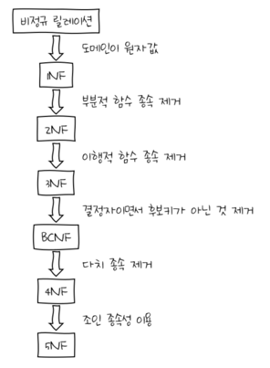

## 정규화

> 함수적 종속성 등의 종속성 이론을 이용하여 잘못 설계된 관계형 스키마를 더 작은 속성의 세트로 쪼개어 바람직한 스키마로 만들어가는 과정

- 하나의 종속성이 하나의 릴레이션에 표현될 수 있도록 분해해가는 과정
- 제1정규형 ~ 제5정규형, 차수가 높아질수록 만족시켜야 할 제약 조건이 증가
- 데이터베이스의 논리적 설계 단계에서 수행
- 논리적 처리 및 품질에 큰 영향
- 일관성, 정확성, 단순성, 비중복성, 안정성
- 정규화 수준이 높을수록 유연한 데이터 구축이 가능하고 데이터의 정확성이 높아지는 반면,  
  물리적 접근이 복잡하고 너무 많은 조인으로 인해 조회 성능이 저하된다

### 목적

- 데이터 구조의 안정성 및 무결성 유지
- 어떠한 릴레이션이라도 데이터베이스 내에서 표현 가능
- 효과적인 검색 알고리즘 생성
- 데이터 중복을 배제하여 이상(Anomaly)의 발생 방지 및 자료 저장 공간의 최소화가 가능
- 데이터 삽입 시 릴레이션을 재구성할 필요성 감소
- 데이터 모형의 단순화 가능
- 속성의 배열 상태 검증 가능
- 개체와 속성의 누락 여부 확인 가능
- 자료 검색과 추출의 효율성 추구

### 이상(Anomaly)의 개념 및 종류

정규화를 거치지 않으면 데이터베이스 내에 데이터들이 불필요하게 중복되어 릴레이션 조작 시 예기치 못한 곤란한 현상이 발생하는데, 이를 이상(Anomaly)이라 하며 삽입 이상, 삭제 이상, 갱신 이상이 있다

- 삽입 이상(Insertion Anomaly): 릴레이션에 데이터를 삽입할 때 의도와는 상관없이 원하지 않는 값들도 함께 삽입되는 현상
- 삭제 이상(Deletion Anomaly): 릴레이션에서 한 튜플을 삭제할 때 의도와는 상관없는 값들도 함께 삭제되는 연쇄가 일어나는 현상
- 갱신 이상(Update Anomaly): 릴레이션에서 튜플레 있는 속성값을 갱신할 때 일부 튜플의 정보만 갱신되어 정보에 모순이 생기는 현상

### 정규화 원칙

- 정보의 무손실 표현: 하나의 스키마를 다른 스키마로 변환할 때 정보의 손실이 있어서는 안 된다
- 분리의 원칙: 하나의 독립된 관계성은 하나의 독립된 릴레이션으로 분리시켜 표현해야 한다
- 데이터의 중복성이 감소되어야 한다

### 정규화 과정

#### 초기 비정규화된 테이블

| 학번 | 이름   | 과목과 성적      | 동아리     |
| ---- | ------ | ---------------- | ---------- |
| 1    | 홍길동 | 수학:90, 영어:80 | 축구, 바둑 |
| 2    | 이순신 | 역사:95          | 음악       |

#### 제1정규형 (1NF)

각 컬럼에 원자값만 있도록 수정 → 즉, 과목과 성적, 동아리 정보를 분리

| 학번 | 이름   | 과목 | 성적 | 동아리 |
| ---- | ------ | ---- | ---- | ------ |
| 1    | 홍길동 | 수학 | 90   | 축구   |
| 1    | 홍길동 | 영어 | 80   | 바둑   |
| 2    | 이순신 | 역사 | 95   | 음악   |

#### 제2정규형 (2NF)

부분적 함수 종속성을 제거  
→ 동아리 정보가 학번에만 종속되어 있으므로, 이를 별도의 테이블로 분리

▶ 학생 성적 목록

| 학번 | 이름   | 과목 | 성적 |
| ---- | ------ | ---- | ---- |
| 1    | 홍길동 | 수학 | 90   |
| 1    | 홍길동 | 영어 | 80   |
| 2    | 이순신 | 역사 | 95   |

▶ 학생 동아리 목록

| 학번 | 동아리 |
| ---- | ------ |
| 1    | 축구   |
| 1    | 바둑   |
| 2    | 음악   |

#### 제3정규형 (3NF)

이행적 함수 종속성을 제거  
→ 예를 들어, 학생 이름이 학번에 종속되어 있기 때문에 이름을 별도의 테이블로 분리

▶ 학생 목록

| 학번 | 이름   |
| ---- | ------ |
| 1    | 홍길동 |
| 2    | 이순신 |

▶ 성적 목록

| 학번 | 과목 | 성적 |
| ---- | ---- | ---- |
| 1    | 수학 | 90   |
| 1    | 영어 | 80   |
| 2    | 역사 | 95   |

▶ 동아리 목록

| 학번 | 동아리 |
| ---- | ------ |
| 1    | 축구   |
| 1    | 바둑   |
| 2    | 음악   |

#### 제4정규형 (4NF)

모든 다치 종속성이 기본키에 대해서만 존재

| 학번 | 과목 |
| ---- | ---- |
| 1    | 수학 |
| 1    | 영어 |
| 2    | 역사 |

**제5정규형 (5NF)**

모든 조인 종속성이 후보키를 통해서만 만족되는 상태

| 학번 | 과목 | 선생님 |
| ---- | ---- | ------ |
| 1    | 수학 | 김수학 |
| 1    | 영어 | 박영어 |
| 2    | 역사 | 최역사 |
