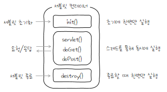

## 서블릿(Servlet)

> 자바를 사용하여 웹 페이지를 동적으로 생성하는 서버 측의 프로그램

- 순수 자바 코드로 작성
- HTTP 요청을 받아 처리하고 HTTP 응답을 생성하는 역할

---

### 서블릿의 동작과정

HttpServlet 클래스를 상속받는 서블릿 클래스(MyServlet)를 구현  
→ 컨테이너는 url mapping 설정을 참고하여 서블릿을 등록  
→ 서블릿 객체 생성 및 init() 메서드를 실행  
→ 클라이언트 요청은 스레드로 동시 처리되며 각각 service() 메서드를 호출  
→ service() 메서드는 doGet(), doPost() 등 프로토콜에 따른 메서드를 호출  
→ 컨테이너 종료 혹은 웹 애플리케이션 종료 시점에 destroy() 메서드를 실행  
→ 서블릿을 등록 해제

---

### 생명주기

> 서블릿은 컨테이너에 의해 동작 → 객체의 생성 과정과 종료 과정도 컨테이너 안에서 이루어진다



---

### 서블릿의 특징

- **플랫폼 독립성**: 자바 기반으로 개발되므로, 서블릿은 다양한 플랫폼에서 실행될 수 있습니다.
- **보안**: 자바의 보안 기능을 활용하여, 안전한 웹 애플리케이션을 개발할 수 있습니다.
- **이식성**: 자바와 웹 컨테이너 표준을 따르기 때문에, 다양한 서버와 컨테이너에서 서블릿을 이동시키거나 배포할 수 있습니다.
- **효율성**: 서블릿은 멀티스레딩을 지원하여, 동시에 여러 요청을 효율적으로 처리할 수 있습니다.

---

### 페이지 이동

> 서블릿은 MVC 패턴 구조의 컨트롤러에 해당

- 리다이렉트

  사용자 요청 처리 후 별도의 데이터를 포함하지 않는다면 해당 페이지로 바로 리디렉션할 수 있다.

  ```
  response.sendRedirect("main.jsp");
  ```

- 포워드

  만일 데이터를 포함하여 이동한다면 request 속성으로 데이터를 넣은 후 원하는 페이지로 포워딩 해야한다. 데이터의 활용 목적에 따라 session이나 application을 사용할 수 있으며 여러 데이터를 포함하는 것도 가능하다.

  - 서블릿으로 구현

  ```java
  doGet(...){
      ...
      request.setAttribute("memner", m);
      RequestDispatcher dispatcher = request.getRequestDispatcher("userInfo.jsp");
      dispatcher.forward(request, response);
  }
  ```

  - 스프링 프레임워크로 구현

  ```java
  @GetMapping("info")
  public String getMemberInfo(int id, Model model) {
      ...
      model.addAttribute("member", m);
      return "userinfo";
  }
  ```
