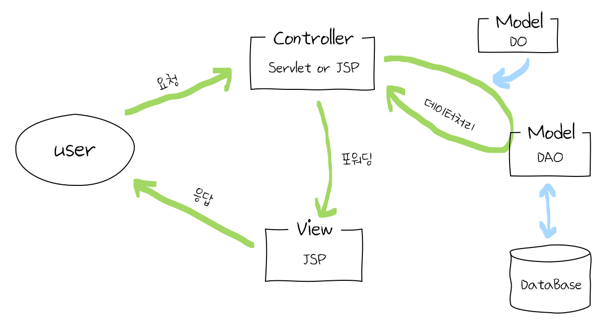

## MVC 패턴

> Model-View-Controller의 약어로 주로 GUI 기반의 애플리케이션 개발에 사용되는 디자인패턴  
> 사용자 인터페이스와 비즈니스 로직을 분리하여 유지 보수성이나 재사용성을 향상

### MVC 패턴의 구조

#### 모델 (Model)

> 데이터를 처리하는 영역  
> 데이터베이스와 연동을 위한 DAO 클래스와 데이터 구조를 표현하는 DO, 엔티티 클래스 등으로 구성

1. 데이터 : 일반적으로 모델은 어플 비즈니스 도메인을 나타내는 데이터를 포함한다.  
   상품, 주문, 고객 등 같은 개념들이 모델로 표현될 수 있다.
2. 비즈니스 로직 : 데이터에 처리되어야 하는 연산과 규칙도 포함된다.  
   주문 모델 - 주문 취소, 결제 완료 등을 처리하는 메소드가 있다.
3. 상태 관리 : 자기 상태를 스스로 관리한다. 해당 상태를 다른 데이터베이스에 저장하며,  
   읽기 및 업데이트가 가능하다.
4. 변경 통지 : MVC 패턴에서 모델은 Observer 패턴을 사용하여 자신의 상태가 변했음을  
   컨트롤러나 뷰에 통지할 수 있다.
5. 독립성 : 모델은 뷰나 컨트롤러로부터 독립적이다.  
   뷰의 사용이나 컨트롤러의 요청에 모델 코드가 변경될 필요가 없다.

#### 뷰 (View)

> 화면 구성을 담당하는 영역

1. 데이터 표현 : 뷰는 모델이 제공하는 데이터를 사용자에게 표현하는 것이다.
2. 템플릿 엔진 : 스프링 MVC에서 뷰는 주로 JSP, Thymeleaf, FreeMarker 등의 템플릿 엔진을 이용한다.  
    이러한 템플릿 엔진들은 동적인 웹페이지 생성을 가능하게 하며, 서버 측에서 데이터와 함께 HTML을 생성해서
   클라이언트에게 전달한다.
3. 데이터 바인딩 : 뷰는 컨트롤러로 받은 모델 객체를 화면에 바인딩한다.  
   실제 데이터 값을 화면 요소에 연결하여 동적으로 내용을 변경할 수 있다.
4. 입력 처리 : 뷰는 사용자의 입력을 받아 컨트롤러에 전달한다.
5. 독립성 : MVC 패턴에서 뷰는 모델의 구조나 로직을 알 필요가 없다.  
   뷰는 단순히 컨트롤러가 전달해준 데이터를 화면에 출력하기만 하면 된다.

#### 컨트롤러

> MVC 패턴의 핵심으로 모든 사용자 요청의 중심이 위치  
> 모델과 뷰 사이의 중개 역할을 하며, 모델을 변경하거나 변경된 상태를 뷰에 전달

1. 요청 처리 : 컨트롤러는 클라이언트로부터 들어오는 모든 요청을 받아들인다.  
   이 요청은 웹 어플리케이션에서 HTTP요청(GET, POST 등)으로 들어올 수 있다.
2. 비즈니스 로직 : 컨트롤러는 받은 요청에 따라 모델을 호출한다.
3. View 선택 : 비즈니스 로직이 처리된 후 반환된 결과 데이터와 함께 어떤 화면을 보여줄지 결정한다.
4. 모델과 뷰 연결 : 뷰에게 처리 결과 데이터(Model)를 전달한다.  
   View 컴포넌트가 데이터와 템플릿 엔진을 사용하여 최종 HTML 페이지를 생성한다.
5. @Controller 어노테이션 : 컨트롤러 클래스를 사용하기 위해서는 어노테이션을 붙인다.  
   각 핸들러 메소드가 특정 URL패턴에 대응되어 HTTP 요청을 처리 후 적절한 응답을 반환한다.
