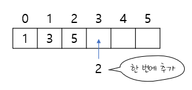
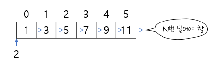

## 배열

### 배열의 특징

1. 연속적인 메모리 공간 : 배열의 데이터들이 메모리에서 연속적으로 할당되기 때문에,  
   인덱스를 통해 데이터에 접근할 수 있다.
2. 고정된 크기 : 배열은 생성할 때 크기가 결정되며 일단 생성된 배열의 크기는 변경할 수 없다.
3. 인덱스 기반 접근 : 시작 요소가 0번째로 시작된다.  
   인덱스 기반 접근이기 때문에 빠른 읽기와 쓰기가 가능하다.
4. 동일한 유형의 데이터 저장

- 장점 : 속도가 빠르다, 연속적인 할당으로 캐시 지역성(Cache Locality) 성능 향상, 간단하고 직관적
- 단점 : 크기 제약, 삭제와 삽입 불가능, 메모리 낭비

### 배열 연산의 시간 복잡도

배열은 임의 접근이라는 방법으로 배열의 모든 위치에 있는 데이터에 단 한번에 접근할 수 있다.  
따라서 데이터에 접근하기 위한 시간 복잡도는 O(1)이다.

그렇다면 배열에 데이터를 추가하는 경우는 어떨까?

- 맨 뒤에 삽입할 경우  
    
  위와 같은 배열이 있을 때, 맨 뒤에 2를 삽입하게 된다면 arr[3]에 임의 접근을 바로 할 수 있으며,  
  데이터를 바로 삽입해도 다른 데이터 위치에 영향을 주지 않는다.  
  시간복잡도는 O(1)이 된다.

- 맨 앞에 삽입할 경우  
    
  이 경우는 기존 데이터들을 한 칸씩 밀어야 하므로 연산이 필요하게 된다.  
  시간복잡도는 O(N)이 된다.  
  중간에 삽입하는 경우도 마찬가지로  
  삽입하는 위치 이후의 데이터는 한 칸씩 밀어야 하므로 시간복잡도는 O(N)으로 같다.

### 자주 사용하는 리스트 기법

#### 데이터 추가

- append() 메서드: 맨 끝에 데이터 추가

```python
my_list = [1, 2, 3]
my_list.append(4)   # [1, 2, 3, 4]
```

- \+ 연산자: 리스트 맨 끝네 다른 리스트의 데이터를 추가할 수도 있다.

```python
my_list = [1, 2, 3]
my_list = my_list + [4, 5]  # [1, 2, 3, 4, 5]
```

- insert() 메서드: 특정 위치에 데이터 삽입

```python
my_list = [1, 2, 3, 4, 5]
my_list.insert(2, 9999) # [1, 2, 9999, 3, 4, 5]
```

#### 데이터 삭제

- pop() 메서드: 특정 위치의 데이터 삭제

```python
my_list = [1, 2, 3, 4, 5]
popped_element = my_list.pop(2) # 3
print(my_list)  # [1, 2, 4, 5]
```

- remove() 메서드: pop()과 달리 특정 위치가 아닌, 특정 데이터 자체를 삭제  
  인수로 받은 값이 처음 등장하는 위치의 데이터를 삭제

```python
my_list = [1, 2, 3, 2, 4, 5]
my_list.remove(2)   # [1, 3, 2, 4, 5]
```

#### 리스트 컴프리헨션

> 기존 리스트를 기반해 새 리스트를 만들거나  
> 반복문, 조건문을 이용해 복잡한 리스트를 생성하는 등 다양한 상황에서 사용할 수 있는 문법

예시)

```python
numbers = [1, 2, 3, 4, 5]
squares = [num**2 for num in numbers]   # [1, 4, 9, 16, 25]
```

#### 이외에 자주 사용되는 메서드

- len(): 리스트의 전체 데이터 개수를 반환
- index(): 특정 데이터가 처음 등장한 인덱스를 반환, 없으면 -1 반환
- sort(): 사용자가 정한 기준에 따라 리스트 데이터를 정렬  
  ❕아무런 인수도 전달하지 않으면, 오름차순으로 데이터를 정렬  
  ❕my_list.sort(reverse=True)로 기준을 전달하면 내림차순으로 정리한다.
- count(): 특정 데이터의 개수를 반환
