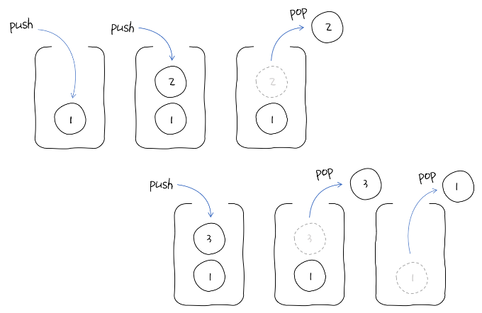

## 스택

먼저 입력한 데이터를 제일 나중에 꺼낼 수 있는 자료구조

- 선입후출(FILO)
- 푸시(push): 스택에 삽입하는 연산
- 팝(pop): 꺼내는 연산

### 동작 원리



(테트리스 게임과 비슷?!)

### 스택의 ADT

    ADT란?
    - 추상 자료형(abstract data type)
    - 인터페이스만 있고 실제로 구현은 되지 않은 자료형

| 정의                     | 설명                                                                                            |
| ------------------------ | ----------------------------------------------------------------------------------------------- |
| boolean isFull()         | - 스택에 들어 있는 데이터가 개수가 maxsize인지 확인<br>- 가득 차 있다면 True, 아니면 False      |
| boolean isEmpty()        | - 스택에 들어 있는 데이터가 하나도 없는지 확인<br>- 데이터가 하나라도 있다면 False, 아니면 True |
| void push(ItemType item) | - 스택에 데이터를 푸시                                                                          |
| ItemType pop()           | - 스택에서 가장 최근에 푸시한 데이터를 팝하고 그 데이터를 반환                                  |
| Int top                  | - 스택에서 최근에 푸시한 데이터의 위치를 기록                                                   |
| ItemType data[maxsize]   | - 스택의 데이터를 관리하는 배열<br>- 최대 maxsize개의 데이터를 관리                             |

### 스택 구현

> 데이터를 그냥 저장하고 순서와 상관 없이 임의 접근하기만 해도 되면 배열을 사용하면 되지만, 최근에 삽입한 데이터를 대상으로 뭔가 연산해야 한다면 스택을 떠올리는 것이 좋다.

스택의 ADT를 구현하면 다음과 같다.

```python
stack = []
max_size = 10

def isFull(stack):
    return len(stack) == max_size

def isEmpty(stack):
    return len(stack) == 0

def push(stack, item):
    if isFull(stack):
        print("스택이 가득 찼습니다.")
    else:
        stack.append(item)
        print("데이터가 추가되었습니다.")

def pop(stack):
    if isEmpty(stack):
        print("스택이 비어 있습니다.")
        return None
    else:
        return stack.pop()
```

그러나 파이썬의 리스트는 크기를 동적으로 관리하므로 max_size나 isFull() 함수, isEmpty() 함수는 실제 문제를 풀 때 구현하지 않는다.

```python
stack = []

def push(stack, item):
    stack.append(item)
    print("데이터가 추가되었습니다.")

def pop(stack):
    if len(stack) == 0:
        print("스택이 비어 있습니다.")
        return None
    else:
        return stack.pop()
```

여기서 push() 함수, pop() 함수를 구현하는 부분을 보면 실제 이 함수들이 하는 일은 리스트의 append() 메서드, pop() 메서드를 호출하는 것이 전부이다. 그러므로 push() 함수와 pop() 함수는 굳이 구현하지 않아도 된다.

```python
stack = []

# push
stack.append(1)
stack.append(2)
stack.append(3)

# pop
top_element = stack.pop()   # top_element: 3
next_element = stack.pop()  # next_element: 2

# 크기
stack_size = len(stack)
```
