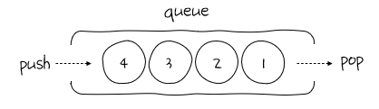

## 큐(queue)

> 먼저 들어간 데이터가 먼저 나온느 자료구조

- 선입선출(FIFO)
- 스택과 마찬가지로 push, pop 연산 수행

### 큐에서 데이터가 이동하는 과정



### 큐의 ADT

| 정의                     | 설명                                                                                          |
| ------------------------ | --------------------------------------------------------------------------------------------- |
| boolean isFull()         | - 큐에 들어 있는 데이터가 개수가 maxsize인지 확인<br>- 가득 차 있다면 True, 아니면 False      |
| boolean isEmpty()        | - 큐에 들어 있는 데이터가 하나도 없는지 확인<br>- 데이터가 하나라도 있다면 False, 아니면 True |
| void push(ItemType item) | - 큐에 데이터를 푸시                                                                          |
| ItemType pop()           | - 큐에서 푸시한 데이터를 팝하고, 그 데이터를 반환                                             |
| int front                | - 큐에서 가장 마지막에 팝한 위치를 기록                                                       |
| int rear                 | - 큐에서 최근에 푸시한 데이터의 위치를 기록                                                   |
| ItemType data[maxsize]   | - 큐의 데이터를 관리하는 배열                                                                 |

### 큐 구현

**1. 리스트를 큐처럼 활용**

스택과의 차이점이 있다면 pop() 메서드에 인수로 0을 넣는다  
인수를 넣지 않으면 맨 뒤에 있는 원소가 삭제된다  
스택은 선입후출이므로 맨 뒤의 원소가 삭제되어야 하지만,  
큐는 선입선출이므로 맨 앞의 원소가 삭제되어야 하기 때문

```python
queue = []

queue.append(1)
queue.append(2)
queue.append(3)

first_item = queue.pop(0)   # 1

queue.append(4)
queue.append(5)

first_item = queue.pop(0)   # 2
```

**2. 덱(Double Enable Queue)을 큐처럼 활용**

양 끝에서 삽입이나 삭제할 수 있는 큐를 구현

```python
from collections import deque

queue = deque()

queue.append(1)
queue.append(2)
queue.append(3)

first_item = queue.popleft()    # 1

queue.append(4)
queue.append(5)

first_item = queue.popleft()   # 2
```

#### pop(0)과 popleft()의 차이

```python
from collection import deque
import time

lst = list(range(100000))
dq = deque(range(100000))

start_time = time.time()
for i in range(100000):
    lst.pop(0)
print("pop(0) 소요시간: ", time.time() - start_time)
# pop(0) 소요시간: 0.79492545...

start_time = time.time()
for i in range(100000):
    dq.popleft()
print("popleft() 소요시간: ", time.time() - start_time)
# popleft() 소요시간: 0.00713753...
```

pop(0)보다 popleft()보다 느리다 → 덱의 성능이 우수하다
