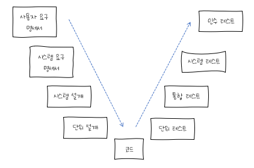
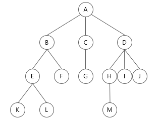
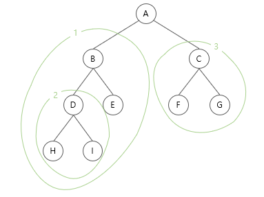
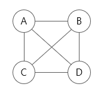
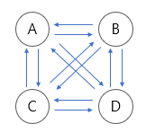
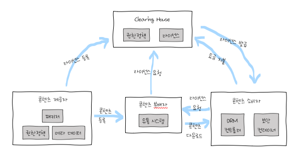

### 21. 소프트웨어 패키징 도구 활용시 고려 사항

#### 소프트웨어 패키징

모듈별로 생성한 실행 파일들을 묶어 배포용 설치 파일을 만드는 것

- 사용자 중심
- 소스 코드는 모듈화하여 패키징: 향후 관리를 고려
- 사용자가 다양한 환경에서 소프트웨어를 손쉽게 사용할 수 있도록 일반적인 배포 형태로 패키징

#### 고려사항

- 사용자의 최소 필요 시스템 환경(OS, CPU, 메모리 등)에 대해 정의
- UI는 시각적인 자료와 함께 제공, 매뉴얼과 일치시켜 패키징
- 소프트웨어는 하드웨어와 함께 관리될 수 있도록 단순 패키징 배포가 아닌 Managed Service 형태로 제공
- 다른 여러 콘텐츠 및 단말기 간 DRM(디지털 저작권 관리) 연동을 고려
- 사용자의 편의성 고려 → 복잡성 및 비효율성 문제
- 적합한 암호화 알고리즘 적용

#### 패키징 작업 순서

1. 기능 식별: 작성된 코드의 기능을 확인
2. 모듈화: 확인된 기능 단위로 코드를 분류
3. 빌드 진행: 모듈 단위로 실행 파일 생성
4. 사용자 환경 분석: 웹, 모바일, PC 등 소프트웨어가 사용될 환경이나  
   운영체제, CPU, RAM 등의 최소 운영 환경 정의
5. 패키징 및 적용 시험
   - 빌드된 실행 파일들을 정의도니 환경에 맞게 배포용 파일 형식으로 패키징
   - 정의된 환경과 동일한 환경에서 패키징 결과를 테스팅
   - 소프트웨어에 대한 불편사항을 사용자 입장에서 확인
6. 패키징 변경 개선: 확인된 불편 사항을 반영하여 진행
7. 배포: 배포 수행 시 오류가 발생하면 해당 개발자에게 수정 요청

---

### 22. EAI(Enterprise Application Integration) 구축 유형 - Hybrid

모듈 연계는 내부 모듈과 외부 모듈 또는 내부 모듈 간 데이터의 교환을 위해 관계를 설정하는 것으로, 대표적인 모듈 연계 방법에는 EAI와 ESB가 있다

#### EAI(Enterprise Application Integration)

- 기업 내 각종 애플리케이션 및 플랫폼 간의 정보 전달, 연계, 통합 등 상호 연동이 가능하게 해주는 솔루션
- 비즈니스 간 통합 및 연계성을 증대 → 효율성 및 각 시스템간의 확장성 ▲

| 구축 유형                 | 기능                                                                                                                                                                                         |
| ------------------------- | -------------------------------------------------------------------------------------------------------------------------------------------------------------------------------------------- |
| Point-to-Point            | - 가장 기본적인 애플리케이션 통합 방식 - 애플리케이션을 1:1로 연결 - 변경 및 재사용이 어렵다                                                                                           |
| Hub & Spoke               | - 중앙 집중형 방식 - 단일 접점인 허브 시스템을 통해 데이터 전송 - 확장 및 유지 보수가 용이 - 허브 장애 발생 시 시스템 전체에 영향                                                   |
| Message Bus (ESB 방식) | - 애플리케이션 사이에 미들웨어를 두어 처리하는 방식 - 확장성이 뛰어나며 대용량 처리가 가능                                                                                                |
| Hybrid                    | - Hub & Spoke와 Message Bus의 혼합 방식 - 그룹 내에서는 Hub & Spoke 방식 - 그룹 간에는 Message Bus 방식 - 필요한 경우 한 가지 방식으로 EAI 구현 가능 - 데이터 병목 현상을 최소화 |

#### ESB(Enterprise Services Bus)

- 애플리케이션 간 연계, 데이터 변환, 웹 서비스 지원 등 표준 기반의 인터페이스를 제공하는 솔루션
- 애플리케이션 통합 측면에서 EAI와 유사하지만, 애플리케이션 보다는 서비스 중심의 통합을 지향
- 특정 서비스에 국한되지 않고 범용적으로 사용하기 위하여  
  애플리케이션과의 결합도를 약하게 유지
- 관리 및 보안 유지가 쉽고, 높은 수준의 품질 지원이 가능

---

### 23. 소스 코드 품질 분석 도구 - 정적 분석 도구

| 클린 코드 작성 원칙 | 설명                                                                                                                       |
| ------------------- | -------------------------------------------------------------------------------------------------------------------------- |
| 가독성              | - 누구든지 코드를 쉽게 읽을 수 있도록 작성한다 - 코드를 작성 시 이해하기 쉬운 용어를 사용하거나 들여쓰기 기능 등을 사용 |
| 단순성              | - 코드를 간단하게 작성 - 한 번에 한 가지를 처리하도록 코드를 작성 - 클래스/메소드/함수 등을 최소 단위로 분리         |
| 의존성 배제         | - 코드가 다른 모듈에 미치는 영향을 최소화 - 코드 변경 시 다른 부분에 영향이 없도록 작성                                 |
| 중복성 최소화       | - 코드의 중복을 최소화 - 중복된 코드는 삭제하고 공통된 코드를 사용                                                      |
| 추상화              | 상위 클래스/메소드/함수에서는 간략하게 애플리케이션의 특성을 나타내고, 상세 내용은 하위 클래스/메소드/함수에서 구현     |

#### 소스 코드 품질 분석 도구

- 정적 분석 도구

  - 작성한 소스 코드를 실행하지 않고 코딩 표준이나 코딩 스타일, 결함 등을 확인하는 코드 분석 도구
  - 비교적 애플리케이션 개발 초기의 결함을 찾는데 사용
  - 개발 완료 시점에서는 개발된 소스 코드의 품질을 검증하는 차원에서 사용
  - 자료 흐름이나 논리 흐름을 분석하여 비정상적인 패턴을 찾을 수 있다
  - 동적 분석 도구로는 발견하기 어려운 결함을 찾아내고,  
    소스 코드에서 코딩의 복잡도, 모델 의존성, 불일치성 등을 분석할 수 있다
  - 종류: pmd, cppcheck, SonarQube, checkstyle, ccm, cobertura 등

- 동적 분석 도구
  - 작성한 소스코드를 실행하여 코드에 존재하는 메모리 누수, 스레드 결함 등을 분석하는 도구
  - 종류: Avalanche, Valgrind 등

| 도구       | 설명                                                                                              | 지원환경       |
| ---------- | ------------------------------------------------------------------------------------------------- | -------------- |
| pmd        | 소스 코드에 대한 미사용 변수, 최적화되지 않은 코드 등 결함을 유발할 수 있는 코드를 검사        | Linux, Windows |
| cppcheck   | C/C++ 코드에 대한 메모리 누수, 오버플로우 등 분석                                                 | Windows        |
| SonarQube  | 중복 코드, 복잡도, 코딩 설계 등을 분석하는 소스 분석 통합 플랫폼                                  | Cross-Platform |
| checkstyle | - 자바 코드에 대해 소스 코드 표준을 따르고 있는지 검사 - 다양한 개발 도구에 통합하여 사용 가능 | Cross-Platform |
| ccm        | 다양한 언어의 코드 복잡도를 분석                                                                  | Cross-Platform |
| cobertura  | 자바 언어의 소스 코드 복잡도 분석 및 테스트 커버리지를 측정                                       | Cross-Platform |
| Avalanche  | - Valgrind 프레임워크 및 STP 기반으로 구현 - 프로그램에 대한 결함 및 취약점 등을 분석          | Linux, Android |
| Valgrind   | 프로그램 내에 존재하는 메모리 및 쓰레드 결함 등을 분석                                            | Cross-Platform |

---

### 24. Postfix 연산식

#### 수식의 표기법

- 전위 표기법(PreFix): 연산자 → Left → Right, +AB
- 중위 표기법(InFix): Left → 연산자 → Right, A+B
- 후위 표기법(PostFix): Left → Right → 연산자, AB+

#### 사용 예시

PreFix 예시

`+ / A - B C * D + E F`  
→ `(+ (/ A (- B C)) (* D (+ E F)))`  
→ `((A / (B - C)) + (D * ( E + F)))`

PostFix 예시

`3 4 * 5 6 * +`  
→ `((3 4 *)(5 6 *) +)`  
→ `((3 * 4) + (5 * 6))` → 42

---

### 25. 인터페이스 보안을 위해 네트워크 영역에 적용될 수 있는 것

IPSec, SSL, S-HTTP

#### 인터페이스 보안

인터페이스는 서로 다른 시스템 사이에서 데이터를 원활히 주고받을 수 있는 통로로 사용되므로  
데이터 변조 및 탈취 등의 위협에 노출되어 있다  
인터페이스의 보안성 향상을 위해서는 인터페이스가 구현되는 각 구간에서  
보안에 취약한 부분을 확인한 후 알맞은 보안 기능을 적용해야 한다

- 네트워크 영역
  - 인터페이스 송·수신 간 스니핑 등을 이용한 데이터 탈취 및 번조 위협을 방지하기 위해  
    네트워크 트래픽에 대한 암호화를 설정
  - 암호화는 인터페이스 아키텍처에 따라 IPSec, SSL, S-HTTP 등의 다양한 방식을 사용
- 애플리케이션 영역
  - 소프트웨어 개발 보안 가이드를 참조하여  
    애플리케이션 코드 상의 보안 취약점을 보완하는 방향으로 애플리케이션 보안 기능을 적용
- 데이터베이스 영역
  - 데이터베이스, 스키마, 엔티티의 접근 권한과  
    프로시저, 트리거 등 데이터베이스 동작 객체의 보안 취약점에 보안 기능을 적용
  - 개인 정보나 업무상 민감한 데이터의 경우 암호화나 익명화 등 데이터 자체의 보안 방안도 고려

---

### 26. 검증(Validation) 검사 기법

V-모델: 소프트웨어 개발 단계와 애플리케이션 테스트를 연결하여 표현

#### 단위 테스트

코딩 직후 소프트웨어 설계의 최소 단위인 모듈이나 컴포넌트에 초점을 맞춰 테스트

- 인터페이스, 외부적I/O, 자료 구조, 독립적 기초 경로, 오류 처리 경로, 경계 조건 등을 검사
- 사용자의 요구사항을 기반으로 한 기능성 테스트를 최우선으로 수행
- 구조 기반 테스트와 명세 기반 테스트로 나뉘지만 주로 구조 기반 테스트를 시행
- 단위 테스트로 발견 가능한 오류
  - 알고리즘 오류에 따른 원치 않는 결과
  - 탈출구가 없는 반복문의 사용
  - 틀린 계산 수식에 의한 잘못된 결과

| 테스트 방법      | 테스트 내용                                                       | 테스트 목적             |
| ---------------- | ----------------------------------------------------------------- | ----------------------- |
| 구조 기반 테스트 | 프로그램 내부 구조 및 복잡도를 검증하는 화이트박스 테스트 시행 | 제어흐름, 조건 결정     |
| 명세 기반 테스트 | 목적 및 실행 코드 기반의 블랙박스 테스트 시행                  | 동등 분할, 경계 값 분석 |

#### 통합 테스트

단위 테스트가 완료된 모듈들을 결합하여 하나의 시스템으로 완성시키는 과정에서의 테스트  
통합 테스트는 모듈 간 또는 통합된 컴포넌트 간의 상화 작용 오류를 검사

#### 시스템 테스트

- 개발된 소프트웨어가 해당 컴퓨터 시스템에서 완벽하게 수행되는가를 점검하는 테스트
- 환경적인 장애 리스크를 최소화하기 위해  
  실제 사용 환경과 유사하게 만든 테스트 환경에서 테스트를 수행

| 테스트 방법       | 설명                                                                                                                                  |
| ----------------- | ------------------------------------------------------------------------------------------------------------------------------------- |
| 기능적 요구사항   | 요구사항 명세서, 비즈니스 절차, 유스케이스 등 명세서 기반의 블랙박스 테스트 시행                                                   |
| 비기능적 요구사항 | 성능 테스트, 회복 테스트, 보안 테스트, 내부 시스템의 메뉴구조, 웹 페이지의 네비게이션 등 구조적 요소에 대한 화이트박스 테스트 시행 |

#### 인수 테스트

개발한 소프트웨어가 사용자의 요구사항을 충족하는지에 중점을 두고 테스트하는 방법

- 개발한 소프트웨어를 사용자가 직접 테스트
- 문제가 없으면 사용자는 소프트웨어를 인수, 프로젝트는 종료

| 테스트 종류          | 설명                                                                                                                                                                                                                                                        |
| -------------------- | ----------------------------------------------------------------------------------------------------------------------------------------------------------------------------------------------------------------------------------------------------------- |
| 사용자 인수 테스트   | 사용자가 시스템 사용의 적절성 여부를 확인                                                                                                                                                                                                                   |
| 운영상의 인수 테스트 | 시스템 관리자가 시스템 인수 시 수행하는 테스트 기법 백업/복원 시스템, 재난 복구, 사용자 관리, 정기 점검 등을 확인                                                                                                                                        |
| 계약 인수 테스트     | 계약상의 인수/검수 조건을 준수하는지 여부를 확인                                                                                                                                                                                                            |
| 규정 인수 테스트     | 소프트웨어가 정부 지침, 법규, 규정 등 규정에 맞게 개발되었는지 확인                                                                                                                                                                                         |
| 알파 테스트          | - 개발자의 장소에서 사용자가 개발자 앞에서 행하는 테스트 기법 - 테스트는 통제된 환경에서 진행 - 오류와 사용상의 문제점을 사용자와 개발자가 함께 확인하면서 기록                                                                                       |
| 베타 테스트          | - 선정된 최종 사용자가 여러 명의 사용자 앞에서 행하는 테스트 기법 - 필드 테스팅 - 실업무를 가지고 사용자가 직접 테스트하는 것 - 개발자에 의해 제어되지 않은 상태에서 진행 - 발결된 오류와 사용상의 문제점을 기록하고 개발자에게 주기적으로 보고 |

---

### 27. 삽입 정렬(Insertion Sort)

이미 순서화된 파일에 새로운 하나의 레코드를 순서에 맞게 삽입시켜 정렬

- 두 번째 키와 첫 번째 키를 비교해 순서대로 나열하고,  
  이어서 세 번째 키를 첫 번째, 두 번째 키와 비교해 순서대로 나열하고,  
  계속해서 n번째 키를 앞의 n-1개의 키와 비교하여 알맞은 순서에 삽입하여 정렬하는 방식
- 평균과 최악 모두 수행 시간 복잡도는 O(n²)

> 초기 자료: 8, 3, 4, 9, 7  
> → 1회전: 3, 8, 4, 9, 7 → 2회전: 3, 4, 8, 9, 7 → 3회전: 3, 4, 8, 9, 7 → 4회전: 3, 4, 7, 8, 9

---

### 28. 소프트웨어 설치 매뉴얼

- 사용자 기준으로 작성
- 설치 시작부터 완료할 때까지의 전 과정을 빠짐없이 순서대로 설명
- 설치 과정에서 표시될 수 있는 오류 메시지 및 예외 상황에 관한 내용을 별도로 분류하여 설명
- 목차 및 개요, 서문, 기본 사항 등이 기본적으로 포함
- 전체 설치 과정을 순서대로 요약한 후 관련 내용의 시작 페이지를 함께 기술
- 설치 매뉴얼의 주요 특징, 구성과 설치 방법, 순서 등의 내용을 기술

#### 기본 사항

| 항목            | 설명                                                                                     |
| --------------- | ---------------------------------------------------------------------------------------- |
| 소프트웨어 개요 | - 소프트웨어의 주요 기능 및 UI 설명 - UI 및 화면 상의 버튼, 프레임 등을 그림으로 설명 |
| 설치 관련 파일  | - 소프트웨어 설치에 필요한 파일 설명 - exe, ini, log 등의 파일 설명                   |
| 설치 아이콘     | 설치 아이콘 설명                                                                         |
| 프로그램 삭제   | 설치된 소프트웨어의 삭제 방법 설명                                                       |
| 관련 추가 정보  | - 소프트웨어 이외의 관련 설치 프로그램 정보 - 소프트웨어 제작사 등의 추가 정보 기술   |

---

### 29. 인터페이스 구현 검증 도구

인터페이스 구현 검증은 인터페이스가 정상적으로 문제없이 작동하는지 확인

| 도구     | 기능                                                                                                                                                                                                                                                                                                                          |
| -------- | ----------------------------------------------------------------------------------------------------------------------------------------------------------------------------------------------------------------------------------------------------------------------------------------------------------------------------- |
| xUnit    | - 같은 테스트 코드를 여러 번 작성하지 않게 도와주고, 테스트마다 예상 결과를 기억할 필요가 없게 하는 자동화된 해법을 제공하는 단위 프레임워크 - Smalltalk에 처음 적용되어 SUnit이라는 이름이었으나, Java용의 JUnit, C++용의 CpplUnit, .NET용의 NUnit, Http용의 HttpUnit 등 다양한 언어에 적용되면서 xUnit으로 통칭되고 있다 |
| STAF     | - 서비스 호출 및 컴포넌트 재사용 등 다양한 환경을 지원하는 테스트 프레임워크 - 크로스 플랫폼, 분산 소프트웨어 테스트 환경을 조성할 수 있도록 지원 - 분산 소프트웨어의 각 분산 환경에 설치된 데몬이 프로그램 테스트에 대한 응답을 대신하며, 테스트가 완료되면 이를 통합하고 자동화하여 프로그램을 완성                   |
| FitNesse | 웹 기반 테스트케이스 설계, 실행, 결과 확인 등을 지원하는 테스트 프레임워크                                                                                                                                                                                                                                                    |
| NTAF     | FitNesse의 장점인 협업 기능과 STAF의 장점인 재사용 및 확장성을 통합한 NHN의 테스트 자동화 프레임워크                                                                                                                                                                                                                          |
| Selenium | 다양한 브라우저 및 개발 언어를 지원하는 웹 애플리케이션 테스트 프레임워크                                                                                                                                                                                                                                                     |
| watir    | Ruby를 사용하는 애플리케이션 테스트 프레임워크                                                                                                                                                                                                                                                                                |

---

### 30. 소프트웨어 형상 관리

형상 관리  
소프트웨어의 개발 과정에서 소프트웨어의 변경 사항을 관리하기 위해 개발된 이련의 활동

- 소프트웨어 변경의 원인을 알아내고 제어하며, 적절히 변경되고 있는지 확인하여 해당 담당자에게 통보
- 형장 관리는 소프트웨어 개발의 전 단계에 적용되는 활동이며, 유지보수 단계에서도 수행
- 관리 항목
  - 소스 코드, 프로젝트 계획, 분석서, 설계서, 프로그램, 테스트 케이스 등
- 형상 관리를 통해 가시성과 추적성을 보장함으로써 소프트웨어의 생산성과 품질을 높일 수 있다
- 대표적인 형상 관리 도구에는 Git, CVS, Subversion 등이 있다

#### 형상 관리의 중요성

- 지속적인 소프트웨어의 변경 사항을 체계적으로 추적하고 통제할 수 있다
- 제품 소프트웨어에 대한 무절제한 변경을 방지할 수 있다
- 제품 소프트웨어에서 발견된 버그나 수정 사항을 추적할 수 있다
- 소프트웨어는 형태가 없어 가시성이 결핍되므로 진행 정도를 확인하기 위한 기준으로 사용될 수 있다
- 소프트웨어의 배포본을 표율적으로 관리할 수 있다
- 소프트웨어를 여러 명의 개발자가 동시에 개발할 수 있다

#### 형상 관리 기능

- 형상 식별: 형상 관리 대상에 이름과 관리 번호를 부여하고, 계층 구조로 구분하여 수정 및 추적이 용이하도록 하는 작업
- 버전 제어: 소프트웨어 업그레이드나 유지 보수 과정에서 생성된 다른 버전의 형상 항목을 관리하고, 이를 위해 특정 철차와 도구를 결합시키는 작업
- 형상 통제(변경 관리): 식별된 형상 항목에 대한 변경 요구를 검토하여 현재의 기준선이 잘 변영될 수 있도록 조정하는 작업
- 형상 감사: 기준선의 무결성을 평가하기 위해 확인, 검증, 검열 과정을 통해 공식적으로 승인하는 작업
- 형상 기록(상태 보고): 형상의 식별, 통제, 감사 작업의 결과를 기록, 관리하고 보고서를 작성하는 작업

---

### 31. 내부 스키마

    물리적 저장 장치의 입장에서 본 데이터베이스 구조로서
    실제로 데이터베이스에 저장될 레코드의 형식을 정의하고
    저장 데이터 항목의 표현 방법, 내부 레코드의 물리적 순서 등을 나타낸다

데이터베이스 개요

**1. 데이터저장소**

- 논리 데이터저장소: 데이터 및 데이터 간의 연관성, 제약조건을 식별하여 논리적인 구조로 조직화한 것
- 물리 데이터저장소: 논리 데이터저장소에 저장된 데이터와 구조들을 소프트웨어가 운용될 환경의 물리적 특성을 고려하여 하드웨어적인 저장장치에 저장한 것

논리 데이터 저장소를 거쳐 물리 데이터저장소를 구축하는 과정은 데이터베이스를 구축하는 과정과 동일하다

**2. 데이터베이스**

- 통합된 데이터: 자료의 중복을 배제한 데이터의 모임
- 저장된 데이터: 컴퓨터가 접근할 수 있는 저장 매체에 저장된 자료
- 운영 데이터: 조직의 고유한 업무를 수행하는 데 존재 가치가 확실하고 없어서는 안 될 반드시 필요한 자료
- 공용 데이터: 여러 응용 시스템들이 공동으로 소유하고 유지하는 자료

**3. DBMS(DataBase Management System, 데이터베이스 관리 시스템)**

DBMS란 사용자와 데이터베이스 사이에서 사용자의 요구에 따라 정보를 생성해주고, 데이터베이스를 관리해 주는 소프트웨어

- 기존의 파일 시스템이 갖는 데이터의 종속성과 중복성의 문제를 해결하기 위해 제안된 시스템으로, 모든 응용 프로그램들이 데이터베이스를 공용할 수 있도록 관리해준다
- 데이터베이스의 구성, 접근 방법, 유지관리에 대한 모든 책임을 진다
- 필수 기능
  - 정의(Definition) 기능: 모든 응용 프로그램들이 요구하는 데이터 구조를 지원하기 위해 데이터베이스에 저장될 데이터의 형(Type)과 구조에 대한 정의, 이용 방식, 제약 조건 등을 명시하는 기능
  - 조작(Manipulation) 기능: 데이터 검색, 갱신, 삽입, 삭제 등을 체계적으로 처리하기 위해 사용자와 데이터베이스 사이의 인터페이스 수단을 제공하는 기능
  - 제어(Control) 기능: 무결성, 권한 검사, 병행 제어

장점

- 데이터의 논리적, 물리적 독립성이 보장
- 데이터의 중복을 피할 수 있어 기억 공간이 절약
- 저장된 자료를 공동으로 이용
- 데이터의 일관성, 무결성, 보안 유지
- 데이터를 표준화
- 데이터를 통합화여 관리
- 항상 최신의 데이터를 유지
- 데이터의 실시간 처리가 가능

단점

- 데이터베이스의 전문가가 부족
- 전산화 비용이 증가
- 대용량 디스크로의 집중적인 Access로 과부하가 발생
- 파일의 예비와 회복이 어려움
- 시스템 복잡

**4. 스키마**

데이터베이스의 구조와 제약 조건에 관한 전반적인 명세를 기술한 메타데이터의 집합

- 스키마는 데이터베이스를 구성하는 데이터 개체(Entity), 속성(Attribute), 관계(Relationship) 및 데이터 조작시 데이터 값들이 갖는 제약 조전 등에 관해 전반적으로 정의
- 사용자의 관점에 따라
  - 외부 스키마: 사용자나 응용 프로그래머가 각 개인의 입장에서 필요로 하는 데이터베이스의 논리적 구조를 정의한 것
  - 개념 스키마
    - 데이터베이스의 전체적인 논리적 구조로서, 모든 응용 프로그램이나 사용자들이 필요로 하는 데이터를 종합한 조직 전체의 데이터베이스로, 하나만 존재한다
    - 개체 간의 관계와 제약 조건을 나타내고, 데이터베이스의 접근 권한, 보안 및 무결성 규칙에 관한 명세를 정의
  - 내부 스키마: 물리적 저장장치의 입장에서 본 데이터베이스 구조로서, 실제로 데이터베이스에 저장될 레코드의 형식을 정의하고 저장 데이터 항목의 표현 방법, 내부 레코드의 물리적 순서 등을 나타낸다

---

### 32. 트리

정점(Node)과 선분(Branch)을 이용하여 사이클을 이루지 않도록 구성한 그래프의 특수 형태

노드(Node): 하나의 기억 공간
링크(Link): 노드와 노드를 연결하는 선

#### 트리 관련 용어

- 노드(Node): 트리의 기본 요소로서 자료 항목과 다른 항목에 대한 가지를 합친 것  
  A, B, C, D, E, F, G, H, I, J, K, L, M
- 근 노드(Root Node): 트리의 맨 위에 있는 노드  
  A
- 디그리(Degree, 차수): 각 노드에서 뻗어 나온 가지의 수  
  A = 3, B = 2, C = 1, D = 3, ...
- 단말 노드(Terminal) = 잎 노드(Leaf Node): 자식이 하나도 없는 노드, 즉 디그리가 0인 노드  
  K, L, F, G, M, I, J
- 자식 노드(Son Node): 어떤 노드에 연결된 다음 레벨의 노드들  
  D의 자식 노드 = H, I, J
- 부모 노드(Parent Node): 어떤 노드에 연결된 이전 레벨의 노드들  
  E, F의 부모 노드 = B
- 형제 노드(Brother Node, Sibling): 동일한 부모를 갖는 노드들  
  H의 형제 노드 = I, J
- 트리의 디그리: 노드들의 디그리 중에서 가장 많은 수  
  노드 A나 D가 3개의 디그리를 가지므로 트리의 디그리는 3이다

#### 트리의 운행법

- Preorder 운행: Root → Left → Right
- Inorder 운행: Left → Root → Right
- Postorder 운행: Left → Right → Root

예시)

서브트리를 하나의 노드로 생각할 수 있도록 그림과 같이 서브트리 단위로 묶어서 순서를 파악  
(Preorder, Inoder, Postorder 모두 공통으로 사용)

- Preorder: A 1 3 → A B 2 E C F G → A B D H I E C F G
- Inorder: 1 A 3 → 2 B E A F C G → H D I B E A F C G
- Postorder: 1 3 A → 2 E B F G C A → H I D E B F G C A

---

### 33. n개의 노드로 구성된 무방향 그래프의 최대 간선 수는?

그래프 G는 정접 V(Vertex)와 간선 E(Edge)의 두 집합으로 이루어진다

- 간선의 방향성 유무에 따라 방향에 따라 방향 그래프와 무방향 그래프로 구분
- 트리는 사이클이 없는 그래프

**무방향 그래프**

최대 간선 수: n(n-1)/2 = 6

**방향 그래프**

최대 간선 수: n(n-1) = 12

---

### 34. 테스트 용어

    - 테스트의 결과가 참인지 거짓인지를 판단하기 위해서 사전에 정의된 참값을 입력하여 비교하는 기법 및 활동
    - 종류에는 참, 샘플링, 휴리스틱, 일관성 검사가 존재

    ▷ 테스트 오라클

#### 테스트 케이스

구현된 소프트웨어가 사용자의 요구사항을 정확하게 준수했는지를 확인하기 위해 설계된 입력 값, 실행 조건, 기대 결과 등으로 구성된 테스트 항목에 대한 명세서로, 명세 기반 테스트의 설계 산출물에 해당

- 테스트 케이스를 미리 설계하면 테스트 오류를 방지할 수 있고 테스트 수행에 필요한 인력, 시간 등의 낭비를 줄일 수 있다
- 테스트 케이스는 테스트 목표와 방법을 설정한 후 작성한다
- 테스트 케이스는 시스템 설계 단계에서 작성하는 것이 가장 이상적이다

#### 테스트 시나리오

테스트 케이스를 적용하는 순서에 따라 여러 개의 테스트 케이스들을 묶은 집합으로, 테스트 케이스들을 적용하는 구체적인 절차를 명세한 문서

- 테스트 시나리오에는 테스트 순서에 대한 구체적인 절차, 사전 조건, 입력 데이터 등이 설정되어 있다
- 테스트 시나리오를 통해 테스트 순서를 미리 정함으로써 테스트 항목을 빠짐없이 수행할 수 있다

#### 테스트 오라클

테스트 오라클은 테스트 결과가 올바른지 판단하기 위해 사전에 정의된 참 값을 대입하여 비교하는 기법 및 활동

- 결과를 판단하기 위해 테스트 케이스에 대한 예상 결과를 계산하거나 확인
- 특징
  - 제한된 검증: 테스트 오라클을 모든 테스트 케이스에 적용할 수 없다
  - 수학적 기법: 테스트 오라클의 값을 수학적 기법을 이용하여 구할 수 있다
  - 자동화 기능: 테스트 대상 프로그램의 실행, 결과 비교, 커버리지 측정 등을 자동화할 수 있다
- 종류
  - 참(True) 오라클: 모든 테스트 케이스의 입력 값에 대해 기대하는 결과를 제공하는 오라클로, 발생된 모든 오류를 검토할 수 있다
  - 샘플링(Sampling) 오라클: 특정한 몇몇 테스트 케이스의 입력 값들에 대해서만 기대하는 결과를 제공하는 오라클
  - 추정(Heuristic) 오라클: 샘플링 오라클을 개선한 오라클로, 특정 테스트 케이스의 입력 값에 대해 기대하는 결과를 제공하고, 나머지 입력 값들에 대해서는 추정으로 처리하는 오라클
  - 일관성(Consistent) 검사 오라클: 애플리케이션의 변경이 있을 때, 테스트 케이스의 수행 전과 후의 결과 값이 동일한지를 확인하는 오라클

---

### 35. 빌드 자동화 도구

빌드: 소스 코드 파일들을 컴파일한 후 여러 개의 모듈을 묶어 실행 파일로 만드는 과정  
빌드 자동화 도구: 빌드를 포함하여 테스트 및 배포를 자동화하는 도구

- 애자일 환경에서는 하나의 작업이 마무리될 때마다 모듈 단위로 나눠서 개발된 코드들이 지속적으로 통합되는데, 이러한 지속적인 통합 개발 환경에서 빌드 자동화 도구는 유용하게 활용된다
- Ant, Make, Maven, Gradle, Jenkins 등

#### Jenkins

JAVA 기반의 오픈 소스 형태로, 가장 많이 사용되는 빌드 자동화 도구

- 서블릿 컨테이너에서 실행되는 서버 기반 도구
- SVN, Git 등 대부분의 형상 관리 도구와 연동이 가능
- 친숙한 Web GUI 제공으로 사용이 쉽다
- 여러 대의 컴퓨터를 이용한 분산 빌드나 테스트가 가능

#### Gradle

Gradle은 Groovy를 기반으로 한 오픈 소스 형태의 자동화 도구  
안드로이드 앱 개발 환경에서 사용된다

    Groovy?
    JAVA에 Python, Ruby, Smalltalk 등의 장점을 결합한 동적 객체 지향 프로그래밍 언어

- 안드로이드 뿐만 아니라 플러그인을 설정하면, JAVA, C/C++, Python 등의 언어도 빌드 가능
- Groovy를 사용해서 만든 DSL(Domain Specific Language)을 스크립트 언어로 사용
- Gradle 은 실행할 처리 명령들을 모아 태스크(Task)로 만든 후 태스크 단위로 실행
- 이전에 사용했던 태스크를 재사용하거나 다른 시스템의 태스크를 공유할 수 있는 빌드 캐시 기능을 지원하므로 빌드의 속도를 향상시킬 수 있다

---

### 36. 저작권 관리(DRM, Digital Right Management) 구성 요소

#### 디지털 저작권 관리의 흐름 및 구성 요소

- 클리어링 하우스(Clearing House): 저작권에 대한 사용 권한, 라이선스 발급, 암호화된 키 관리, 사용량에 따른 결제 관리 등을 수행

- 콘텐츠 제공자(Contents Provider): 콘텐츠를 제공하는 저작권자

- 패키저(Packager): 콘텐츠를 메타 데이터와 함께 배포 가능한 형태로 물어 암호화하는 프로그램

- 콘텐츠 분배자(Contents Distributor): 암호화된 콘텐츠를 유통하는 곳이나 사람

- 콘텐츠 소비자(Customer): 콘텐츠를 구매해서 사용하는 주체

- DRM 컨트롤러(DRM Controller): 배포된 콘텐츠의 이용 권한을 통제하는 프로그램

- 보안 컨테이너(Security Container): 콘텐츠 원본을 안전하게 유통하기 위한 전자적 보안 장치

#### 디지털 저작권 관리의 기술 요소

| 요소                          | 설명                                                        |
| ----------------------------- | ----------------------------------------------------------- |
| 암호화(Encryption)            | 콘텐츠 및 라이선스를 암호화하고 전자 서명을 할 수 있는 기술 |
| 키 관리(Key Management)       | 콘텐츠를 암호화한 키에 대한 저장 및 분배 기술               |
| 암호화 파일 생성(Packager)    | 콘텐츠를 암호화된 콘텐츠로 생성하기 위한 기술               |
| 식별 기술(Identification)     | 콘텐츠에 대한 식별 체계 표현 기술                           |
| 저작권 표현(Right Expression) | 라이선스의 내용 표현 기술                                   |
| 정책 관리(Policy Management)  | 라이선스 발급 및 사용에 대한 정책 표현 및 관리 기술         |
| 크랙 방지(Tamper Resistance)  | 크랙에 의한 콘텐츠 사용 방지 기술                           |
| 인증(Authentication)          | 라이선스 발급 및 사용의 기준이 되는 사용자 인증 기술        |

---

### 37. 블랙박스 테스트 기법

동적 테스트

- 프로그램을 실행하여 오률르 찾는 테스트로, 소프트웨어 개발의 모든 단계에서 테스트를 수행
- 화이트박스 테스트, 블랙박스 테스트

#### 화이트박스 테스트

모듈의 원시 코드를 오픈시킨 상태에서 원시 코드의 논리적인 모든 경로를 테스트하여 테스트 케이스를 설계하는 방법

- 화이트박스 테스트는 설계된 절차에 초점을 둔 구조적 테스트로 프로시저 설계의 제어 구조를 사용하여 테스트 케이스를 설계하며, 테슽 과정의 초기에 적용된다
- 모듈 안의 작동을 직접 관찰
- 원시 코드의 모든 문장을 한 번 이상 실행함으로써 수행
- 프로그램의 제어 구조에 따라 선택, 반복 등의 분기점 부분들을 수행함으로써 논리적 경로를 제어
- 종류
  - 기초 경로 검사(Base Path Testing)
    - 대표적인 화이트박스 테스트 기법
    - 테스트 케이스 설계자가 절차적 설계의 논리적 복잡성을 측정할 수 있게 해주는 테스트 기법으로, 테스트 측정 결과는 실행 경로의 기초를 정의하는 데 지침으로 사용
  - 제어 구조 검사(Control Structure Testing)
    - 조건 검사(Condition Testing): 프로그램 모듈 내에 있는 논리적 조건을 테스트
    - 루프 검사(Loop Testing): 프로그램의 반복 구조에 초점을 맞춰 실시
    - 데이터 흐름 검사(Data Flow Testing): 프로그램에서 변수의 정의와 변수 사용의 위치에 초점을 맞춰 실시
- 검증 기준
  - 문장 검증 기준(Statement Coverage): 소스 코드의 모든 구문이 한 번 이상 수행되도록 테스트 케이스 설계
  - 분기 검증 기준(Branch Coverage): 결정 검증 기준(Decision Coverage)이라고도 불리며, 소스 코드의 모든 조건문에 대해 조건이 True인 경우와 False인 경우가 한 번 이상 수행되도록 테스트 케이스 설계
  - 조건 검증 기준(Condition Coverage): 소스 코드의 조건문에 포함된 개별 조건식의 결과가 True인 경우와 False인 경우가 한 번 이상 수행되도록 테스트 케이스 설계
  - 분기/조건 기준(Branch/Condition Coverage): 분기 검증 기준과 조건 검증 기준을 모두 만족하는 설계로, 조건문이 True인 경우와 False인 경우에 따라 조건 검증 기준의 입력 데이터를 구분하는 테스트 케이스 설계

#### 블랙박스 테스트

소프트웨어가 수행할 특정 기능을 알기 위해서 각 기능이 완전히 작동되는 것을 입증하는 테스트로, 기능 테스트라고도 한다

- 프로그램 구조를 고려하지 않기 때문에 테스트 케이스는 프로그램 또는 모듈의 요구나 명세를 기초로 결정
- 스프트웨어 인터페이스에서 실시되는 테스트
- 부정확하거나 누락된 기능, 인터페이스 오류, 자료 구조나 외부 데이터베이스 접근에 따른 오류, 행위나 성능 오류, 초기화와 종료 오류 등을 발견하기 위해 사용되며, 테스트 과정의 후반부에 적용
- 종류
  - 동치 분할 검사(Equivalence Partitioning Testing, 동치 클래스 분해)
    - 입력 자료에 초점을 맞춰 테스트 케이스(동치 클래스)를 만들고 검사하는 방법으로 동등 분할 기법이라고도 한다
    - 프로그램의 입력 조건에 타당한 입력 자료와 타당하지 않은 입력 자료의 개수를 균등하게 하여 테스트 케이스를 정하고, 해당 입력 자료에 맞는 결과가 출력되는지 확인
  - 경계값 분석(Boundary Value Analysis)
    - 입력 자료에만 치중한 동치 분할 기법을 보완하기 위한 기법
    - 입력 조건의 중간값보다 경계값에서 오류가 발생될 확률이 높다는 점을 이용하여 입력 조건의 경계값을 테스트 케이스로 선정하여 검사
  - 원인-효과 그래프 검사(Cause-Effact Graphing Testing)
    - 입력 데이터 간의 관계와 출력에 영향을 미치는 상황을 체계적으로 분석한 다음 효용성이 높은 테스트 케이스를 선정하여 검사
  - 오류 예측 검사(Error Guessing)
    - 과거의 경험이나 확인자의 감각으로 테스트하는 기법
    - 다른 블랙박스 테스트 기법으로는 찾아낼 수 없는 오류를 찾아내는 일련의 보충적 검사 기법이며, 데이터 확인 검사라고도 한다
  - 비교 검사(Comparison Testing)
    - 여러 버전의 프로그램에 동일한 테스트 자료를 제공하여 동일한 결과가 출력되는지 테스트

---

### 38. 해싱 함수

#### 이분 검색(이진 검색, Binary Search)

- 전체 파일을 두 개의 서브파일로 분리해 가면서 Key 레코드를 검색
- 반드시 순서화된 파일이어야 검색할 수 있다
- 찾고자 하는 Key 값을 파일의 중간 레코드 Key 값과 비교하면서 검색
- 비교 횟수를 거듭할 때마다 검색 대상이 되는 데이터의 수가 절반으로 줄어들게 되므로 탐색 효율이 좋고 탐색 시간이 적게 소요
- 중간 레코드 번호: M = (F + L) / 2 (F: 첫 번째 체코드 번호, L: 마지막 레코드 번호)

#### 해싱(Hashing)

해시 테으블이라는 기억 공간을 할당하고, 해시 함수를 이용하여 레코드 키에 대한 해시 테이블 내의 홈 주소를 계산한 후 주어진 레코드를 해당 기억장소에 저장하거나 검색 작업을 수행하는 방식

**해시 테이블**

레코드를 한 개 이상 보관할 수 있는 버킷들로 구성된 기억공간으로,  
보조기억장치에 구성할 수도 있고 주기억장치에 구성할 수도 있다

- 버킷
  - 하나의 주소를 갖는 파일의 한 구역을 의미
  - 버킷의 크기는 같은 주소에 포함될 수 있는 레코드 수를 의미
- 슬롯
  - 한 개의 레코드를 저장할 수 있는 공간
  - n개의 슬롯이 보여 하나의 버킷을 형성
- Collision
  - 서로 다른 두 개 이상의 레코드가 같은 주소를 갖는 현상
- Synonym
  - 충돌로 인해 같은 Home Address를 갖는 레코드들의 집합
- Overflow
  - 계산된 Home Address의 bucket 내 저장할 기억공간이 없는 상태
  - Bucket을 구성하는 Slot이 여러 개일 때 Collision은 발생해도 Overflow는 발생하지 않을 수 있다

**해싱 함수**

- 제산법(Division): 해시 테이블의 크기보다 큰 수 중에서 가장 작은 소수로 나눈 나머지
- 제곱법(Mid-Square): 키 값을 제곱한 후 그 중간 부분의 값
- 폴딩법(Folding): XOR(배타적 논리합)한 값
- 기수 변환법(Radix): 다른 진수로 변환
- 대수적 코딩법(Algebraic Coding): 키 값을 이루고 있는 각 자리의 비트 수...
- 숫자 분석법(Digit Analysis, 계수 분석법): 키 값을 이루는 숫자의 분포를 분석
- 무작위법(Random): 난수

**Collision(충돌현상) 해결 방법**

- 체이닝(Chaining): 연결 리스트 활용
- 개방 주소법(Open Addressing): 그 다음 빈 버킷을 찾아 저장
- 재해싱(Rehashing): 새로운 해싱 함수를 사용

---

### 39. 클린 코드 작성 원칙

    - 한번에 한 가지 처리만 수행
    - 클래스/메소드/함수를 최소 단위로 분리

    > 단순성

23번 문제 참고

---

### 40. 디지털 저작권 관리(DRM) 기술

    ① 콘텐츠 암호화 및 키 관리
    ② 콘텐츠 식별체계 표현
    ④ 라이선스 발급 및 관리

    > ③ 콘텐츠 오류 감지 및 복구 (X)

36번 문제 참고
