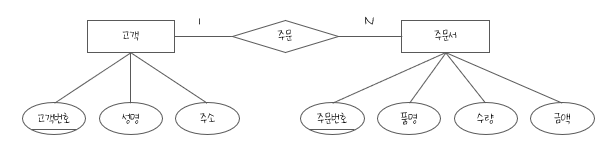

### 41. 트랜잭션의 특징

트랜잭션은 데이터베이스의 상태를 변화시키는 하나의 논리적 기능을 수행하기 위한 작업의 단위 또는 한꺼번에 모두 수행되어야 할 일련의 연상들을 의미

- 데이터베이스 시스템에서 병행 제어 및 회복 작업 시 처리되는 작업의 논리적 단위로 사용
- 사용자가 시스템에 대한 서비스 요구 시 시스템이 응답하기 위한 상태 변환 과정의 작업 단위로 사용

#### 트랜잭션의 상태


#### 특성 - ACID

- Atomicity(원자성)
  - 트랜잭션의 연산은 데이터베이스에 모두 반영되도록 완료(Commit)되든지 아니면 전혀 반영되지 않도록 복구(Rollback)되어야 한다
  - 트랜잭션 내의 모든 명령은 반드시 완벽히 수행되어야 하며, 모두가 완벽히 수행되지 않고 어느 하나라도 오류가 발생하면 트랜잭션 전부가 취소되어야 한다
- Consistency(일관성)
  - 트랜잭션이 그 실행을 성공적으로 완료하면 언제나 일관성 있는 데이터베이스 상태를 변환한다
  - 시스템이 가지고 있는 고정 요소는 트랜잭션 수행 전과 트랜잭션 수행 완료 후의 상태가 같아야 한다
- Isolation(독립성, 격리성, 순차성)
  - 둘 이상의 트랜잭션이 동시에 병행 실행되는 경우 어느 하나의 트랜잭션 실행 중에 다른 트랜잭션의 연산이 끼어들 수 없다
  - 수행 중인 트랜잭션은 완전히 완료될 때까지 다른 트랜잭션에서 수행 결과를 참조할 수 없다
- Durability(영속성, 지속성)
  - 성공적으로 완료된 트랜잭션의 결과는 시스템이 고장나더라도 영구적으로 반영되어야 한다

---

### 42. CRUD 분석

생성(Create), 읽기(Read), 갱신(Update), 삭제(Delete)

트랜잭션의 CRUD 연산에 대해 CRUD 매트릭스를 작성하여 분석하는 것

- CRUD 분석으로 테이블에 발생되는 트랜잭션의 주기별 발생 횟수를 파악하고 연관된 테이블들을 분석하면 테이블에 저장되는 데이터의 양을 유추할 수 있다
- CRUD 분석을 통해 많은 트랜잭션이 몰리는 테이블을 파악할 수 있으므로 디스크 구성 시 유용한 자료로 활용할 수 있다
- CRUD 분석을 통해 외부 프로세스 트랜잭션의 부하가 집중되는 데이터베이스 채널을 파악하고 분산시킴으로써 연결 지연이나 타임아웃 오류를 방지할 수 있다

#### CRUD 매트릭스

2차원 형태의 표로서, 행에는 프로세스를, 열에는 테이블을 행과 열이 만나는 위치에는 프로세스가 테이블에 발생시키는 변화를 표시하는 업무 프로세스와 데이터 간 상관 분석표

- CRUD 매트릭스를 통해 프로세스의 트랜잭션이 테이블에 수행하는 작업을 검증
- CRUD 매트릭스의 각 셀에는 Create, Read, Update, Delete의 앞 글자가 들어가며, 복수의 변화를 줄 때는 기본적으로 C > D > U > R의 우선 순위를 적용하여 한 가지만 적지만, 활용 목적에 따라 모두 기록할 수 있다
- CRUD 매트릭스가 완성되었다면, CRUD 중 어느 것도 적히지 않은 행이나, 열, CR이 없는 열을 확인하여 불필요하거나 누락된 테이블 또는 프로세스를 찾는다

예시)

|     구분      | 회원 | 상품 | 주문 | 주문목록 | 제조사 |
| :-----------: | :--: | :--: | :--: | :------: | :----: |
| 신규회원 등록 |  C   |      |      |          |
| 회원정보 변경 | R, U |      |      |          |
|   주문 요청   |  R   |  R   |  C   |    C     |
|   주문 변경   |      |      |  R   |   R, U   |
|   주문 취소   |      |      | R, D |   R, D   |
|   상품 등록   |      |  C   |      |          |  C, R  |
| 상품정보 변경 |      | R, U |      |          |  R, U  |

---

### 43. 반정규화

    반정규화?
    정규화된 엔티티, 속성, 관계를 시스템의 향상과 개발 운영의 단순화를 위해 중복, 통합, 분리 등을 수행하는 데이터 모델링 기법

### 44. DDL(Data Define Language, 데이터 정의어)

#### CREATE SCHEMA

스키마의 식별을 위해 스키마 이름과 소유권자나 허가권자를 정의

```SQL
CREATE SCHEMA 스키마명 AUTHORIZATION 사용자_ID;
```

#### CREATE DOMAIN

- 임의의 속성에서 취할 수 있는 값으 범위가 SQL에서 지원하는 전체 데이터 타입의 값이 아니고 일부분일 때, 사용자는 그 값의 범위를 도메인으로 정의할 수 있다
- 정의된 도메인 명은 일반적인 데이터 타입처럼 사용한다

```SQL
CREATE DOMAIN 도메인명 [AS] 데이터_타입
    [DEFAULT 기본값]
    [CONSTRAINT 제약조건명 CHECK (범위값)];
```

#### CREATE TABLE

```SQL
CREATE TABLE 테이블명
    (속성명 데이터_타입 [DEFAULT 기본값] [NOT NULL], ...
    [, PRIMARY KEY(기본키_속성명, ...)]
    [, UNIQUE(대체키_속성명, ...)]
    [, FOREIGN KEY(외래키_속성명, ...)]
        [REFERENCES 참조테이블(기본키_속성명, ...)]
        [ON DELETE 옵션]
        [ON UPDATE 옵션]
    [, CONSTRAINT 제약조건명] [CHECK (조건식)]);
```

#### CREATE VIEW

```SQL
CREATE VIEW 뷰명[(속성명[, 속성명, ...])]
AS SELECT문;
```

#### CREATE INDEX

```SQL
CREATE [UNIQUE] INDEX 인덱스명
ON 테이블명(속성명 [ASC | DESC] [, 속성명 [ASC | DESC]])
[CLUSTER];
```

#### ALTER TABLE

테이블에 대한 정의를 변경

```SQL
ALTER TABLE 테이블명 ADD 속성명 데이터_타입 [DEFAULT '기본값'];
ALTER TABLE 테이블명 ALTER 속성명 데이터_타입 [SET DEFAULT '기본값'];
ALTER TABLE 테이블명 DROP COLUMN 속성명 [CASCADE];
```

- ADD: 새로운 속성(열)을 추가할 때 사용
- ALTER: 특정 속성의 Default 값을 변경할 때 사용
- DROP COLUMN: 특정 속성을 삭제할 때 사용

#### DROP

스키마, 도메인, 기본 테이블, 뷰 테이블, 인덱스, 제약 조건 등을 제거

```SQL
DROP SCHEMA 스키마명 [CASCADE | RESTRICT];
DROP DOMAIN 도메인명 [CASCADE | RESTRICT];
DROP TABLE 테이블명 [CASCADE | RESTRICT];
DROP VIEW 뷰명 [CASCADE | RESTRICT];
DROP INDEX 인덱스명 [CASCADE | RESTRICT];
DROP CONSTRAINT 제약조건명;
```

    CASCADE?
    제거할 요소를 참조하는 다른 모든 개체를 함께 제거
    참조 무결성 제약 조건을 설정하기 위해 사용

    RESTRICT?
    다른 개체가 제거할 요소를 참조 중일 때는 제거를 취소

---

### 45. 정규화의 필요성

- 데이터 구조의 안정성 및 무결성 유지
- 어떠한 릴레이션이라도 데이터베이스 내에서 표현 가능
- 효과적인 검색 알고리즘 생성
- 데이터 중복을 배제하여 이상(Anomaly)의 발생 방지 및 자료 저장 공간의 최소화가 가능
- 데이터 삽입 시 릴레이션을 재구성할 필요성 감소
- 데이터 모형의 단순화 가능
- 속성의 배열 상태 검증 가능
- 개체와 속성의 누락 여부 확인 가능
- 자료 검색과 추출의 효율성 추구

---

### 46. 개체-관계 모델의 E-R 다이어그램에서 사용되는 기호와 의미

| 기호이름  | 의미                                                         |
| --------- | ------------------------------------------------------------ |
| 사각형    | 개체(Entity) 타입                                            |
| 마름모    | 관계(Relationship) 타입                                      |
| 타원      | 속성(Attribute)                                              |
| 이중 타원 | 다중값 속성(복합 속성)                                       |
| 밑줄 타원 | 기본키 속성                                                  |
| 복수 타원 | 복합 속성                                                    |
| 관계      | 1:1, 1:N, N:M 등의 개체 간 관계에 대한 대응수를 선 위에 기술 |
| 선, 링크  | 개체 타입과 속성을 연결                                      |



- 개체: 고객, 주문서
- 속성
  - 고객의 속성: 고객번호, 성명, 주소
  - 주문서의 속성: 주문번호, 품명, 수량, 금액
- 관계: '고객'과 '주문서'의 '주문' 관계는 일대 다의 관계
- 밑줄 친 속성은 기본키

---

### 47. DML(Date Manipulation Language, 데이터 조작어)

```sql
UPDATE 회원 () 전화번호 = '010-14'
WHERE 회원번호 = 'n4';
```

    정답: SET

#### 삽입문(INSERT INTO ~)

```SQL
INSERT INTO 테이블명([속성명1, 속성명2, ...])
VALUES (데이터1, 데이터2, ...);
```

#### 삭제문(DELETE FROM ~)

```SQL
DELETE FROM 테이블명
[WHERE 조건];
```

#### 갱신문(UPDATE ~ SET ~)

```SQL
UPDATE 테이블명 SET 속성명 = 데이터[, 속성명 = 데이터, ...]
[WHERE 조건];
```

---

### 48. 관계형 데이터베이스의 제약조건 - Key

릴레이션에 있는 모든 튜플에 대해 유일성은 만족시키지만 최소성을 만족시키지 못한는 키?

#### 후보키

릴레이션을 구성하는 속성들 중에서 튜플을 유일하게 식별하기 위해 사용하는 속성들의 부분집합  
즉, 기본키로 사용할 수 있는 속성들

- 하나의 릴레이션 내에서는 중복된 튜플이 있을 수 없으므로 모든 릴레이션에는 반드시 하나 이상의 후보키가 존재
- 후보키는 릴레이션에 있는 모든 튜플에 대해서 유일성과 최소성을 만족시켜야 한다
  - 유일성(Unique): 하나의 키 값으로 하나의 튜플만을 유일하게 식별할 수 있어야 한다
  - 최소성(Minimality): 모든 레코드들을 유일하게 식별하는 데 꼭 필요한 속성으로만 구성되어야 한다

#### 기본키

후보키 중에서 특별히 선정된 주키(Main Key)로 중복된 값을 가질 수 없다

- 한 릴레이션에서 특정 튜플을 유일하게 구별할 수 있는 속성
- 기본키는 후보키의 성질을 갖는다
- 유일성과 최소성을 가지며 튜플을 식별하기 위해 반드시 필요한 키
- 기본키는 NULL 값을 가질 수 없다

#### 대체키

후보키가 둘 이상일 때 기본키를 제외한 나머지 후보키

#### 슈퍼키

한 릴레이션 내에 있는 속성들의 집합으로 구성된 키로서 릴레이션을 구성하는 모든 튜플들 중 슈퍼키로 구성된 속성의 집합과 동일한 값은 나타나지 않는다

- 슈퍼키는 릴레이션을 구성하는 모든 튜플에 대해 유일성은 만족시키지만,  
  최소성은 만족시키지 못한다

#### 외래키

다른 릴레이션의 기본키를 참조하는 속성 또는 속성들의 집합

- 외래키는 참조되는 릴레이션의 기본키와 대응되어 릴레이션 간에 참조 관계를 표현하는 데 중요한 도구
- 한 릴레이션에 속한 속성 A와 참조 릴레이션의 기본키인 B가 동일한 도메인 상에서 정의되었을 때의 속성 A를 외래키라고 한다
- 외래키로 지정되면 참조 릴레이션의 기본키에 없는 값은 입력할 수 없다

---

### 49. DCL(Data Control Language, 데이터 제어어)

#### GRANT / REVOKE

- GRANT: 권한 부여
- REVOKE: 권한 취소
- 사용자 등급 지정 및 해제
  ```sql
  GRANT 사용자등급 TO 사용자_ID_리스트 [IDENTIFIED BY 암호];
  REVOKE 사용자등급 FROM 사용자_ID_리스트;
  ```
- 테이블 및 속성에 대한 권한 부여 및 취소
  ```sql
  GRANT 권한_리스트 ON 개체 TO 사용자 [WITH GRANT OPTION];
  REVOKE [GRANT OPTION FOR] 권한_리스트 ON 개체 FROM 사용자 [CASCADE];
  ```
  - 권한 종류: ALL, SELECT, INSERT, DELETE, UPDATE, ALTER 등

#### COMMIT / ROLLBACK

트랜잭션이 성공적으로 끝나면 데이터베이스가 새로운 일관성 상태를 가지기 위해 변경된 모든 내용을 데이터베이스에 반영하여야 하는데, 이때 사용하는 명령이 COMMIT

ROLLBACK은 아직 COMMIT되지 않은 변경된 모든 내용들을 취소하고 데이터베이스를 이전 상태로 되돌리는 명령어

COMMIT 명령을 실행하지 않아도 DML문이 성공적으로 완료되면 자동으로 COMMIT 되고, DML이 실패하면 자동으로 ROLLBACK이 되도록 Auto Commit 기능을 설정할 수 있다

#### SAVEPOINT

트랜잭션 내에 ROLLBACK 할 위치인 저장점을 지정하는 명령어

```SQL
SAVEPOINT S1;
DELETE FROM 사원 WHERE 사원번호 = 20;

ROLLBACK TO S1;
```

---

### 50. 관계대수

관계형 데이터베이스에서 원하는 정보와 그 정보를 검색하기 위해서 어떻게 유도하는가를 기술하는 절차적인 언어

- 릴레이션을 처리하기 위해 연산자와 연산규칙을 제공하는 언어로 피연산자가 릴레이션이고, 결과도 릴레이션이다
- 질의에 대한 해를 구하기 위해 수행해야 할 연산의 순서를 명시
- 관계대수에는 관계 데이터베이스에 적용하기 위해 특별히 개발한 순수 관계 연산자와 수학적 집합 이론에서 사용하는 일반 집합 연산자가 있다
- 순수 관계 연산자: Select, Project, Join, Division
- 일반 집합 연산자: UNION(합집합), INTERSECTION(교집합), DIFFERENCE(차집합), CARTESIAN PRODUCT(교차곱)

#### 순수 관계 연산자

**1. Select**

릴레이션에 존재하는 튜플 중에서 선택 조건을 만족하는 튜플의 부분집합을 구하여 새로운 릴레이션을 만드는 연산

- 릴레이션의 행에 해당하는 튜플을 구하는 것이므로 수평 연산이라고도 한다
- 연산자의 기호는 그리스 문자 시그마(σ)를 사용
- σ<조건>(R)
  - R은 릴레이션 이름
  - 조건에서는 =, ≠, ＜, ≤, ＞, ≥ 등의 기호를 사용한 비교 연산이 허용되며,  
    AND(∧), OR(∨), NOT(￢) 등의 논리 연산자를 사용하여  
    여러 개의 조건들을 하나의 조건으로 결합시킬 수도 있다

**2. Project**

주어진 릴레이션에서 속성 리스트(Attribute List)에 제시된 속성 값만을 추출하여 새로운 릴레이션을 만드는 연산  
단, 연산 결과에 중복이 발생하면 중복이 제거된다

- 릴레이션의 열에 해당하는 Attribute를 추출하는 것이므로 수직 연산이라고도 한다
- 연산자의 기호는 그리스 문자 파이(π)를 사용
- π<속성리스트>(R)

**3. Join**

공통 속성을 중심으로 두 개의 릴레이션을 하나로 합쳐서 새로운 릴레이션을 만드는 연산

- Join의 결과로 만들어진 릴레이션의 차수는 조인된 두 릴레이션의 차수를 합한 것과 같다
- Join의 결과는 Cartesian Product(교차곱)를 수행한 다음 Select를 수행한 것과 같다
- 연산자의 기호는 ▷◁를 사용
- R ▷◁키속성r=키속성s S
  - 키속성r은 릴레이션 R의 속성, 키속성s은 릴레이션 S의 속성

**4. Division**

X ⊃ Y 인 두 개의 릴레이션 R(X)와 S(Y)가 있을 때, R의 속성이 S의 속성값을 모두 가진 튜플에서 S가 가진 속성을 제외한 속성만을 구하는 연산

- 연산자의 기호는 ÷를 사용
- R [속성r ÷ 속성s] S

#### 일반 집합 연산자

**1. UNION(합집합)**

- 두 릴레이션에 존재하는 튜플의 합집합을 구하되,  
  결과로 생성된 릴레이션에서 중복되는 튜플은 제거되는 연산
- R ∪ S = {t | t ∈ R ∨ t ∈ S}
- 카디널리티 = |R ∪ S| ≤ |R| + |S|

**2. INTERSECTION(교집합)**

- 두 릴레이션에 존재하는 튜플의 교집합을 구하는 연산
- R ∩ S = {t | t ∈ R ∧ t ∈ S}
- 카디널리티 = |R ∩ S| ≤ MIN{|R|, |S|}

**1. DIFFERENCE(차집합)**

- 두 릴레이션에 존재하는 튜플의 차집합을 구하는 연산
- R - S = {t | t ∈ R ∧ t not∈ S}
- 카디널리티 = |R - S| ≤ |R|

**1. CARTESIAN PRODUCT(교차곱)**

- 두 릴레이션에 있는 튜플들의 순서쌍을 구하는 연산
- R ∩ S = {r·s | r ∈ R ∧ s ∈ S}
- 카디널리티 = |R × S| ≤ |R| × |S|

#### 관계해석(Relational Calculus)

- 관계해석은 관계 데이터의 연산을 표현하는 방법으로, 원하는 정보를 정의할 때는 계산 수식을 사용
- 관계해석은 원하는 정보가 무엇이라는 것만 정의하는 비절차적 특성을 지님
- 튜플 관계해석, 도메인 관계해석
- 기본적으로 관계해석과 관계대수는 관계 데이터베이스를 처리하는 기능과 능력면에서 동등하며, 관계대수로 표현한 식은 관계해석으로 표현할 수 있다
- 주요 논리 기호
  - ∀: 전칭 정량자, 가능한 모든 튜플에 대하여(For All)
  - ∃: 존재 전량자, 하나라도 일치하는 튜플이 있음(There Exists)

---

### 51. SQL문 실행결과는?

```sql
SELECT 과목이름
FROM 성적
WHERE EXISTS (
    SELECT 학번
    FROM 학생
    WHERE 학생.학번 = 성적.학번
        AND 학생.학과 IN ('전산', '전기')
        AND 학생.주소 = '경기');
```

[학생] 테이블

| 학번 |  이름  | 학년 | 학과 | 주소 |
| :--: | :----: | :--: | :--: | :--: |
| 1000 | 김철수 |  1   | 전산 | 서울 |
| 2000 | 고영준 |  1   | 전기 | 경기 |
| 3000 | 유진호 |  2   | 전자 | 경기 |
| 4000 | 김영진 |  2   | 전산 | 경기 |
| 5000 | 정현영 |  3   | 전자 | 서울 |

[성적] 테이블

| 학번 | 과목번호 | 과목이름 | 학점 | 점수 |
| :--: | :------: | :------: | :--: | :--: |
| 1000 |   A100   | 자료구조 |  A   |  91  |
| 2000 |   A200   |    DB    |  A+  |  99  |
| 3000 |   A100   | 자료구조 |  B+  |  88  |
| 3000 |   A200   |    DB    |  B   |  85  |
| 4000 |   A200   |    DB    |  A   |  94  |
| 4000 |   A300   | 운영체제 |  B+  |  89  |
| 5000 |   A300   | 운영체제 |  B   |  88  |

▷ 결과

| 과목이름 |
| :------: |

DB
DB
운영체제

---

### 52. 로킹(Locking) 기법

    ① 로킹의 대상이 되는 객체의 크기를 로킹 단위라고 한다
    ③ 데이터베이스도 로킹 단위가 될 수 있다
    ④ 로킹 단위가 커지면 로크 수가 작아 로킹 오버헤드가 감소한다

    ▷ ② 로킹 단위가 작아지면 병행성 수준이 낮아진다 (X)
         로킹 단위가 작아지면 병행성 수준은 높아진다 (O)

---

### 53. 사용자 X1에게 department 테이블에 대한 검색 연산을 회수하는 명령은?

권한 회수: revoke  
검색 연산: select

`revoke select on department from X1;`

---

### 54. 뷰(View)

사용자에게 접근이 허용된 자료만을 제한적으로 보여주기 위해 하나 이상의 기본 테이블로부터 유도된, 이름을 가지는 가상 테이블

- 저장장치 내에 물리적으로 존재하지 않지만, 사용자에게는 있는 것처럼 간주된다
- 데이터 보정 작업, 처리 과정 시험 등 임시적인 작업을 위한 용도로 활용
- 뷰를 생성하면 뷰 정의가 시스템 내에 저장되었다가 생성된 뷰 이름을 질의어에서 사용할 경우 질의어가 실행될 때 뷰에 정의된 기본 테이블로 대체되어 기본 테이블에 대해 실행된다

#### 특징

- 기본 테이블로부터 유도된 테이블이기 때문에 기본 테이블과 같은 형태의 구조를 사용하며, 조작도 기본 테이블과 거의 같다
- 뷰는 가상 테이블이기 때문에 물리적으로 구현되어 있지 않다
- 데이터의 논리적 독립성을 제공할 수 있다
- 필요한 데이터만 뷰로 정의해서 처리하기 때문에 관리가 용이하고 명령문이 간단해진다
- 뷰를 통해서만 데이터에 접근하게 되면 뷰에 나타나지 않는 데이터를 안전하게 보호하는 효율적인 기법으로 사용할 수 있다
- 기본 테이블의 기본키를 포함한 속성 집합으로 뷰를 구성해야만 삽입, 삭제, 갱신 연산이 가능하다
- 일단 정의된 뷰는 다른 뷰의 정의에 기초가 될 수 있다
- 뷰가 정의된 기본 테이블이나 뷰를 삭제하면 그 테이블이나 뷰를 기초로 정의된 다른 뷰도 자동으로 삭제된다
- 뷰를 정의할 때는 CREATE문, 제거할 때는 DROP문을 사용

#### 장단점

장점

- 논리적 데이터 독립성을 제공
- 동일 데이터에 대해 동시에 여러 사용자의 상이한 응용이나 요구를 지원
- 사용자의 데이터 관리를 간단하게 해준다
- 접근 제어를 통한 자동 보안이 제공

단점

- 독립적인 인덱스를 가질 수 없다
- 뷰의 정의를 변경할 수 없다
- 뷰로 구성된 내용에 대한 삽입, 삭제, 갱신 연산에 제약이 따른다

#### 설계 순서

**1. 대상 테이블 선정**

- 외부 시스템과 인터페이스에 관여하는 테이블
- CRUD 매트릭스를 통해 여러 테이블이 동시에 자주 조인되어 접근되는 테이블
- SQL문 작성 시 거의 모든 문장에서 인라인 뷰 방식으로 접근되는 테이블

**2. 대상 컬럼 선정**

- 보안을 유지해야 하는 컬럼은 주의하여 선별

**3. 정의서 작성**

| 뷰명       | 뷰 설명              | 관련 테이블                             | 관련 컬럼명                                                          | 데이터 타입                                                                       |
| ---------- | -------------------- | --------------------------------------- | -------------------------------------------------------------------- | --------------------------------------------------------------------------------- |
| V_SELLITEM | 판매와 판매목록 처리 | SELL<BR><BR>---------------<BR>SELLITEM | SELLNO<BR>SELLNAME<BR>SELLDATE<BR>---------------<BR>ITEMNO<BR>PRICE | VARCHAR(5)<BR>VARCHAR(40)<BR>DATE<BR>----------------<BR>VARCHAR(5)<BR>NUMBER(10) |

#### 고려사항

- 테이블 구조가 단순화 될 수 있도록 반복적으로 조인을 설정하여 사용하거나 동일한 조건절을 사용하는 테이블을 뷰로 생성
- 동일한 테이블이라도 업무에 따라 테이블을 이용하는 부분이 달라질 수 있으므로 사용할 데이터를 다양한 관점에서 제시
- 데이터의 보안 유지를 고려하여 설계

---

### 55. 데이터 모델에 표시해야 할 요소

    구조, 연산, 제약 조건

---

### 56. 제3정규형에서 보이스코드 정규형(BCNF)으로 정규화하기 위한 작업

    '두부이걸다줘' = '도부이결다조'

---

### 57. A1, A2, A3 3개의 속성을 갖는 한 릴레이션에서 A1의 도메인은 3개 값, A2의 도메인은 2개 값, A3의 도메인은 4개 값을 갖는다. 이 릴레이션에 존재할 수 있는 튜플의 최대 수는?

    3 x 2 x 4 = 24

---

### 58. 데이터베이스 설계 시 물리적 설계 단계에서 수행하는 사항

#### 논리적 설계(데이터 모델링)

현실 세계에서 발생하는 자료를 컴퓨터가 이해하고 처리할 수 있는 물리적 저장장치에 저장할 수 있도록 변환하기 위해 특정 DBMS가 지원하는 놀리적 자료 구조로 변환시키는 과정

- 개념 세계의 데이터를 필드로 기술된 데이터 타입과 이 데이터 타입들 간의 관계로 표현되는 논리적 구조의 데이터로 모델화
- 개념적 설계가 개념 스키마를 설계하는 단계라면,  
  논리적 설계는 개념 스키마를 평가 및 정제하고 DBMS에 따라 서로 다른 논리적 스키마를 설계하는 단계
- 트랜잭션의 인터페이스를 설계
- 관계형 데이터베이스라면 테이블을 설계하는 단계

#### 물리적 설계(데이터 구조화)

논리적 설계 단계에서 논리적 구조로 표현된 데이터를 디스크 등의 물리적 저장장치에 저장할 수 있는 물리적 구조의 데이터로 변환하는 과정

- 물리적 설계 단계에서는 다양한 데이터베이스 응용에 대해 처리 성능을 얻기 위해 데이터베이스 파일의 저장 구조 및 액세스 경로를 결정
- 저장 레코드의 양식, 순서, 접근 경로, 조회가 집중되는 레코드와 같은 정보를 사용하여 데이터가 컴퓨터에 저장되는 방법을 묘사
- 물리적 설계 시 고려할 사항: 트랜잭션 처리량, 응답 시간, 디스크 용량, 저장 공간의 효율성 등

---

### 59. 한 릴레이션 스키마가 4개 속성, 2개 후보키 그리고 그 스키마의 대응 릴레이션 인스턴스가 7개 튜플을 갖는다면 그 릴레이션의 차수는?

    ▷ 차수(Degree)는 속성의 수, 4개

#### 관계형 데이터베이스의 Relation 구조


튜플(Tuple)

- 릴레이션을 구성하는 각각의 행
- 속성의 모임
- 파일 구조에서 레코드와 같은 의미
- 튜플의 수를 카디널리티 또는 기수, 대응수라고 한다

속성(Attribute)

- 데이터베이스를 구성하는 가장 작은 놀리적 단위
- 파일 구조상 데이터 항목 또는 데이터 필드에 해당
- 개체의 특성을 기술
- 속성의 수를 디그리(Degree) 또는 차수라고 한다

도메인(Domain)

- 하나의 애트리뷰트가 취할 수 있는 같은 타입의 원자(Atomic)값들의 집합
- 실제 애트리뷰트 값이 나타날 때 그 값의 합법 여부를 시스템이 검사하는 데도 이용

---

### 60. 데이터웨어하우스의 기본적인 Olap(On-Line Analytical Processing) 연산

OLAP은 다차원으로 이루어진 데이터로부터 통계적인 요약 정보를 분석하여 의사결정에 활용하는 방식

- 데이터 웨어하우스나 데이터 마트와 같은 시스템과 상호 연관되는 정보 시스템
- Roll-up, Drill-down, Drill-through, Drill-across, Pivoting, Slicing, Dicing
