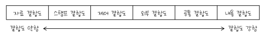

### 61. UNIX SHELL 명령어

    UNIX나 LINUX에서는
    set, env, printenv, setenv 중 하나를 입력하면
    모든 환경 변수와 값을 표시

---

### 62. Java 프로그래밍 언어의 정수 데이터 타입

| 종류 | 데이터타입 | 크기  |
| ---- | ---------- | ----- |
| 문자 | char       | 2Byte |
| 정수 | byte       | 1Byte |
|      | short      | 2Byte |
|      | int        | 4Byte |
|      | long       | 8Byte |
| 실수 | float      | 4Byte |
|      | double     | 8Byte |
| 논리 | boolean    | 1Byte |

---

### 63. Java에서 사용되는 출력함수?

    System.out.printf(서식 문자열, 변수)
    System.out.print() → 값이나 변수의 내용을 형식없이 출력
    System.out.println() → 커서를 다음 줄의 처음으로 이동

---

### 64. 운영체제 - 커널의 기능

#### 커널(Kernel)

- UNIX의 가장 핵심적인 부분
- 컴퓨터가 부팅될 때 주기억장치에 적재된 후 상주하면서 실행
- 하드웨어를 보호하고, 프로그램과 하드웨어 간의 인터페이스 역할을 담당
- 프로세스(CPU 스케줄링) 관리, 기억장치 관리, 파일 관리, 입/출력 관리, 프로세스간 통신, 데이터 전송 및 변환 등 여러가지 기능을 수행

#### 쉘(SHELL)

- 사용자의 명령어를 인식하여 프로그램을 호출하고 명령을 수행하는 명령어 해석기
- 시스템과 사용자 간의 인터페이스를 담당
- DOS의 COMMAND.COM 과 같은 기능을 수행
- 주기억장치에 상주하지 않고, 명령어가 포함된 파일 형태로 존재하며 보조 기억장치에서 교체 처리가 가능
- 파이프라인 기능을 지원하고 입/출력 재지정을 통해 출력과 입력의 방향을 변경할 수 있다
- 공용 shell(Bourne Shell, C Shell, Korn Shell)이나 사용자 자신이 만든 Shell을 사용할 수 있다

#### Utility Program

- 일반 사용자가 작성한 응용프로그램을 처리하는 데 사용
- DOS에서의 외부 명령어에 해당
- 에디터, 컴파일러, 인터프리터, 디버거 등

---

### 65. OSI 7계층

    단말기 사이에 오류 수정과 흐름 제어를 수행하여 신뢰성 있고 명확한 데이터를 전달하는 계층은?

#### OSI(Open System Interconnection) 참조 모델

다른 시스템 간의 원활한 통신을 위해 ISO(국제표준화기구)에서 제안한 통신 규약(Protocol)

- OSI 7계층
  - 하위 계층(1~3 계층): 물리 계층 → 데이터 링크 계층 → 네트워크 계층
  - 상위 계층(4~7 계층): 전송 계층 → 세션 계층 → 표현 계층 → 응용 계층

#### 물리 계층(Physical Layer)

전송에 필요한 두 장치 간의 실제 접속과 절단 등 기계적, 전기적, 기능적, 절차적 특성에 대한 규칙을 정의

- 물리적 전송 매체와 전송 신호 방식을 정의
- 표준: RS-2323C, X.21 등
- 관련 장비: 리피터, 허브

#### 데이터 링크 계층(Data Link Layer)

두 개의 인접한 개방 시스템들 간에 신뢰성 있고 효율적인 정보 전송을 할 수 있도록 시스템 간 연결 설정과 유지 및 종료를 담당

- 송신 측과 수신 측의 속도 차이를 해결하기 위한 흐름 제어 기능
- 프레임의 시작과 끝을 구분하기 위한 프레임 동기화 기능
- 오류의 검출과 회복을 위한 오류 제어 기능
- 프레임의 순서적 전송을 위한 순서 제어 기능
- 표준: HDLC, LAPB, LLC, MAC, LAPD, PPP 등
- 관련 장비: 랜카드, 브리지, 스위치

#### 네트워크 계층(Network Layer)

개방 시스템들 간의 네트워크 연결을 관리하는 기능과 데이터의 교환 및 중계 기능

- 네트워크 연결을 설정, 유지, 해제하는 기능
- 발신자와 목적지의 논리 주소가 추가된 패킷을 최종 목적지까지 전달
- 경로 설정(Routing), 데이터 교환 및 중계, 트래픽 제어, 패킷 정보 전송을 수행
- 표준: X.25, IP 등
- 관련 장비: 라우터

#### 전송 계층(Transport Layer)

논리적 안정과 균일한 데이터 전송 서비스를 제공함으로써 종단 시스템(End-to-End) 간에 투명한 데이터 전송을 가능하게 한다

- OSI 7계층 중 하위 3계층과 상위 3계층의 인터페이스를 담당
- 종단 시스템 간의 전송 연결 설정, 데이터 전송, 연결 해제 기능
- 주소 설정, 다중화(분할 및 재조립), 오류 제어, 흐름 제어
- 표준: TCP, UDP 등
- 관련 장비: 게이트웨이

#### 세션 계층(Session Layer)

송/수신 측 간의 관련성을 유지하고 대화 제어를 담당

- 대화(회화) 구성 및 동기 제어, 데이터 교환 관리 기능
- 송/수신 측 간의 데이터 전송, 연결 해제, 동기 처리 등의 대화를 관리하기 위해 토큰이 사용
- 송/수신 측 간의 대화 동기를 위해 전송하는 정보의 일정한 부분에 체크점을 두어 정보의 수신 상태를 체크하며, 이때의 체크점을 동기점(Synchronizatioin Point)이라고 한다
- 동기점은 오류가 있는 데이터의 회복을 위해 사용하는 것으로, 소동기점과 대동기점이 있다

#### 표현 계층(Presentation Layer)

응용 계층으로부터 받은 데이터를 세션 계층에 보내기 전에 통신에 적당한 형태로 변환  
세션 계층에서 받은 데이터는 응용 계층에 맞게 변환하는 기능

- 서로 다른 데이터 표현 형태를 갖는 시스템 간의 상호 접속을 위해 필요한 계층
- 코드 변환, 데이터 암호화, 데이터 압축, 구문 검색, 정보 형식(포맷) 변환, 문맥 관리 기능

#### 응용 계층(Application Layer)

사용자가 OSI 환경에 접근할 수 있도록 서비스를 제공

- 응용 프로세스 간의 정보 교환, 전자 사서함, 파일 전송, 가상 터미널 등의 서비스를 제공

---

### 66. 쉘 스크립트의 의미

```shell
until who | grep wow
do
sleep 5
done
```

▷ wow 사용자가 로그인할 때까지 반목문을 수행

---

### 67. 자바 코드 실행 결과

```java
int x = 1, y = 6;
while (y--) {
    x++;
}
System.out.println("x=" x + "y=" y);
```

▷ Unresolved compilation problem 오류 발생

```java
int x = 1, y = 6;
while (y-- < 0) {
    x++;
}
System.out.println("x=" x + " y=" y);
```

▷ x=7 y=-1

---

### 68. 파이썬 실행 결과

```python
a = [0,10,20,30,40,50,60,70,80,90]
a[:7:2]
```

▷ [0, 20, 40, 60]

**슬라이스**

```python
객체명[초기위치:최종위치:증가값]
```

일부 인수는 생략하여 사용 가능

---

### 69. 공통 모듈의 재사용 범위에 따른 분류

#### 공통 모듈

여러 프로그램에서 공통적으로 사용할 수 있는 모듈

- 자주 사용되는 계산식이나 매법 필요한 사용자 인증과 같은 기능들이 공통 모듈로 구성될 수 있다
- 모듈의 재사용성 확보와 중복 개발 회피를 위해 설계 과정에서 공통 부분을 식별하고 명세를 작성할 필요가 있다
- 명세 기법: 정확성, 명확성, 완전성, 일관성, 추적성

#### 재사용

비용과 개발 시간을 절약하기 위해 이미 개발된 기능들을 파악하고 재구성하여 새로운 시스템 또는 기능 개발에 사용하기 적합하도록 최적화시키는 작업

- 재사용을 위해서는 누구나 이해할 수 있고 사용이 가능하도록 사용법을 공개
- 재사용되는 대상은 외부 모듈과의 결합도는 낮고, 응집도는 높아야 한다
- 재사용 규모에 따른 분류
  - 함수와 객체: 클래스나 메소드 단위의 소스 코드를 재사용
  - 컴포넌트
    - 독립적인 업무 또는 기능을 수행하는 실행 코드 기반으로 작성된 모듈
    - 컴포넌트 자체에 대한 수정 없이 인터페이스를 통해 통신하는 방식
  - 애플리케이션: 공통된 기능들을 제공하는 애플리케이션을 공유하는 방식

#### 효과적인 모듈 설계 방안

- 결합도는 줄이고 응집도는 높여서 모듈의 독립성과 재사용성을 높인다
- 모듈의 제어 영역 안에서 그 모듈의 영향 영역을 유지
- 복잡도와 중복성을 줄이고 일관성을 유지
- 모듈의 기능은 예측이 가능해야 하며, 지나치게 제한적이어서는 안 된다
- 유지보수가 용이
- 모듈 크기는 시스템의 전반적인 기능과 구조를 이해하기 쉬운 크기로 분해
- 하나의 입구와 하나의 출구
- 인덱스 번호나 기능 코드들이 전반적인 처리 논리 구조에 예기치 못한 영향을 끼치지 않도록 모듈 인터페이스 설계
- 효과적인 제어를 위해 모듈 간의 계층적 관계를 정의하는 자료가 제시되어야 한다

---

### 70. 다음과 같은 프로세스가 차례로 큐에 도착했을 때, SJF(Shortest Job First) 정책을 사용할 경우 가장 먼저 처리되는 작업은?

| 프로세스 번호 | 실행시간 |
| :-----------: | :------: |
|      P1       |    6     |
|      P2       |    8     |
|      P3       |    4     |
|      P4       |    3     |

    SJF는 준비상태 큐에서 기다리고 있는 프로세스들 중에서 실행 시간이 가장 짧은 프로세스에게 먼저 CPU를 할당하는 기법이므로 가장 짧은 시간을 갖고 있는 P4가 첫 번째로 수행

---

### 71. 페이지 교체 알고리즘

페이지 부재(Page Fault)가 발생했을 때, 가상기억장치의 필요한 페이지를 주기억장치에 적재해야 하는데, 이때 주기억장치의 모든 페이지 프레임이 사용중이면 어떤 페이지 프레임을 선택하여 교체할 것인지를 결정하는 기법

**OPT(OPTimal replacement, 최적 교체)**

- 앞으로 가장 오랫동안 사용하지 않을 페이지를 교체하는 기법
- 벨레이디가 제안
- 페이지 부재 횟수가 가장 적게 발생하는 가장 효율적인 알고리즘

**FIFO(First In First Out)**

- FIFO는 각 페이지가 주기억장치에 적재될 때마다 그때의 시간을 기억시켜 가장 먼저 들어와서 가장 오래 있었던 페이지를 교체하는 기법
- 이해하기 쉽고, 프로그래밍 및 설계가 간단하다

  페이지 부재?  
   CPU가 액세스한 가상 페이지가 주기억장치에 없는 경우  
   페이지 부재가 발생하면 해당 페이지를 디스크에서 주기억장치로 가져와야 한다

[예제]

세 개의 페이지 프레임을 가진 기억장치  
참조 페이지 = [2, 3, 2, 1, 5, 2, 3, 5]

| 2   | 3   | 2   | 1   | 5   | 2   | 3   | 5   |
| --- | --- | --- | --- | --- | --- | --- | --- |
| 2   | 2   | 2   | 2   | 5   | 5   | 5   | 5   |
|     | 3   | 3   | 3   | 3   | 2   | 2   | 2   |
|     |     |     | 1   | 1   | 1   | 3   | 3   |
| v   | v   |     | v   | v   | v   | v   |     |

참조 페이지를 각 페이지 프레임에 차례로 적재시키되 이미 적재된 페이지는 해당 위치의 페이지 프레임을 사용한다

사용할 페이지 프레임이 없을 경우 가장 먼저 들어와서 오래 있었던 페이지 2를 제거한 후 5를 적재

그 다음에 적재된 페이지 3을 제거한 후 2를 적재하며, 같은 방법으로 나머지 참조 페이지를 수행

#### LRU(Least Recently Used)

- 최근에 가장 오랫동안 사용하지 않은 페이지를 교체하는 기법
- 각 페이지마다 계수기(Counter)나 스택(Stack)을 두어 현 시점에서 가장 오랫동안 사용하지 않은, 즉 가장 오래 전에 사용된 페이지를 교체

[예제]

세 개의 페이지 프레임을 가진 기억장치  
참조 페이지 = [2, 3, 2, 1, 5, 2, 3, 5]

| 2   | 3   | 2   | 1   | 5   | 2   | 3   | 5   |
| --- | --- | --- | --- | --- | --- | --- | --- |
| 2   | 2   | 2   | 2   | 2   | 2   | 2   | 2   |
|     | 3   | 3   | 3   | 5   | 5   | 5   | 5   |
|     |     |     | 1   | 1   | 1   | 3   | 3   |
| v   | v   |     | v   | v   |     | v   |     |

참조 페이지를 각 페이지 프레임에 차례로 적재시키되 이미 적재된 페이지는 해당 위치의 페이지 프레임을 사용

사용할 페이지 프레임이 없을 경우 현재 시점에서 가장 오랫동안 사용되지 않은 페이지 3을 제거한 후 5를 적재

같은 방법으로 나머지 참조 페이지를 수행

#### LFU(Least Frequently Used)

- 사용 빈도가 가장 적은 페이지를 교체하는 기법
- 활발하게 사용되는 페이지는 사용 횟수가 많아 교체되지 않고 사용

#### NUR(Not Used Recently)

- LRU와 비슷한 알고리즘으로, 최근에 사용하지 않은 페이지를 교체하는 기법
- 최근에 사용되지 않은 페이지는 향후에도 사용되지 않을 가능성이 높다는 것을 전제로, LRU에서 나타나는 시간적인 오버헤드를 줄일 수 있다
- 최근의 사용 여부를 확인하기 위해서 각 페이지마다 두 개의 비트, 즉 참조 비트(Reference Bit)와 변형 비트(Modified Bit, Dirty Bit)가 사용된다

#### SCR(Second Chance Replacement, 2차 기회 교체)

- 가장 오랫동안 주기억장치에 있던 페이지 중 자주 사용되는 페이지의 교체를 방지하기 위한 것으로, FIFO 기법의 단점을 보ㅗ안하는 기법

---

### 72. TCP 흐름 제어 기법

네트워크 내의 원활한 흐름을 위해 송/수신 측 사이에 전송되는 패킷의 양이나 속도를 규제  
송신 측과 수신 측 간의 처리속도 또는 버퍼 크기의 차이에 의해 생길 수 있는 수신 측 버퍼의 오버플로를 방지하기 위한 기능

- 정지-대기(Stop-and-Wait)
  - 수신 측의 확인 신호(ACK)를 받은 후에 다음 패킷을 전송하는 방식
  - 한 번에 하나의 패킷만을 전송할 수 있다
- 슬라이딩 윈도우(Sliding Window)
  - 확인 신호, 즉 수신 통지를 이용하여 송신 데이터의 양을 조절하는 방식
  - 수신 측의 확인 신호를 받지 않더라도 미리 정해진 패킷의 수만큼 연속적으로 전송하는 방식
  - 한 번에 여러 개의 패킷을 전송할 수 있어 전송 효율이 좋다
  - 송신 측은 수신 측으로부터 확인 신호(ACK) 없이도 보낼 수 있는 패킷의 최대치를 미리 약속받는데, 이 패킷의 최대치가 윈도우 크기(Window Size)를 의미
  - 윈도우 크기는 상황에 따라 변화

---

### 73. 결합도(Coupling)

모듈 간에 상호 의존하는 정도 또는 두 모듈 사이의 연관 관계

- 다양한 결합으로 모듈을 구성할 수 있으나 결합도가 약할수록 품질이 높고, 강할수록 품질이 낮다
- 결합도가 강하면 시스템 구현 및 유지보수 작업이 어렵다



#### 자료 결합도

- 모듈 간의 인터페이스가 **자료 요소**로만 구성될 때의 결합도
- 어떤 모듈이 다른 모듈을 호출하면서 매개 변수나 인수로 데이터를 넘겨주고, 호출 받은 모듈은 받은 데이터에 대한 처리 결과를 다시 돌려주는 방식
- 모듈 간의 내용을 전혀 알 필요가 없는 상태로서 한 모듈의 내용을 변경하더라도 다른 모듈에는 전형 영향을 미치지 않는 가장 바람직한 결합도

함수가 매개변수로 단일 값을 전달받아 작업을 수행하는 경우

#### 스템프 결합도

- 모듈 간의 인터페이스로 배열이나 레코드 등의 **자료 구조**가 전달될 때의 결합도
- 두 모듈이 동일한 자료 구조를 조회하는 경우의 결합도
- 자료 구조의 어떠한 변화, 즉 포맷이나 구조의 변화는 그것을 조회하는 모든 모듈 및 변화되는 필드를 실제로 조회하지 않는 모듈에까지도 영향을 미치게 된다

#### 제어 결합도

- 어떤 모듈이 다른 모듈 내부의 논리적인 흐름을 제어하기 위해 제어 신호를 이용하여 통신하거나 제어 요소를 전달하는 결합도
- 한 모듈이 다른 모듈의 상세한 처리 절차를 알고 있어 이를 통제하는 경우나 처리 기능이 두 모듈에 분리되어 설계된 경우에 발생
- 하위 모듈에서 상위 모듈로 제어 신호가 이동하여 하위 모듈이 상위 모듈에게 처리 명령을 내리는 권리 전도현상이 발생하게 된다

함수가 다른 함수에 플래그나 제어 변수를 전달하여 그 실행을 제어하는 경우가 여기에 해당

#### 외부 결합도

- 어떤 모듈에서 선언한 데이터를 외부의 다른 모듈에서 참조할 때의 결합도
- 참조되는 데이터의 범위를 각 모듈에서 제한할 수 있다

두 모듈이 같은 외부 데이터 구조나 전역 변수를 사용할 때 발생

#### 공통 결합도

- 공유되는 공통 데이터 영역을 여러 모듈이 사용할 때의 결합도
- 공통 데이터 영역의 내용을 조금만 변경하더라도 이를 사용하는 모든 모듈에 영향을 미치므로 모듈의 독립성을 약하게 만든다

전역 변수 사용으로 인해 발생하는 결합

#### 내용 결합도

- 한 모듈이 다른 모듈의 내부 기능 및 그 내부 자료를 직접 참조하거나 수정할 때의 결합도
- 한 모듈에서 다른 모듈의 내부로 제어가 이동하는 경우에도 내용 결합도에 해당

한 모듈이 다른 모듈의 내부 구현(예: 코드, 데이터)에 직접적으로 접근하거나 수정하는 경우에 발생

---

### 74. 응집도(Cohesion)

정보 은닉 개념을 확장한 것  
명령어나 호출문 등 모듈의 내부 요소들의 서로 관련되어 있는 정도  
즉, 모듈이 독립적인 기능으로 정의되어 있는 정도를 의미


우연적 응집도(Coincidental)

- 모듈 내부의 각 구성 요소들이 서로 관련 없는 요소로만 구성된 경우

논리적 응집도(Logical)

- 유사한 성격을 갖거나 특정 형태로 분류되는 처리 요소들로 하나의 모듈이 형성되는 경우

시간적 응집도(Temporal)

- 특정 시간에 처리되는 몇 개의 기능을 모아 하나의 모듈로 작성할 경우

절차적 응집도(Communication)

- 모듈이 다수의 관련 기능을 가질 때 모듈 안의 구성 요소들이 그 기능을 순차적으로 수행할 경우

교환적 응집도(Procedural)

- 동일한 입력과 출력을 사용하여 서로 다른 기능을 수행하는 구성 요소들이 모였을 경우

순차적 응집도(Communication)

- 모듈 내 하나의 활동으로부터 나온 출력 데이터를 그 다음 활동의 입력 데이터로 사용할 경우

기능적 응집도(Sequential)

- 모듈 내부의 모든 기능 요소들이 단일 문제와 연관되어 수행될 경우

---

### 75. 접근 제어자

| 한정자    | 클래스 내부 | 패키지 내부 | 하위 클래스 | 패키지 외부 |
| --------- | :---------: | :---------: | :---------: | :---------: |
| Public    |      O      |      O      |      O      |      O      |
| Protected |      O      |      O      |      O      |      X      |
| Default   |      O      |      O      |      X      |      X      |
| Private   |      O      |      X      |      X      |      X      |

---

### 76. UDP(User Datagram Protocol)

- 데이터 전송 전에 연결을 설정하지 않는 비연결형 서비스를 제공
- TCP에 비해 상대적으로 단순한 헤더 구조 → 오버헤드가 적고 흐름 제어나 순서 제어가 없어 전송 속도가 빠르다
- 고속의 안정성 있는 전송 매체를 사용하여 빠른 속도를 필요로 하는 경우, 동시에 여러 사용자에게 데이터를 전달할 경우, 정기적으로 반복해서 전송할 경우에 사용
- 실시간 전송에 유리하며, 신뢰성보다는 속도가 중요시되는 네트워크에ㅓㅅ 사용
- UDP 헤더에는 Source Port Number, Destination Port Number, Length, Checksum 등이 포함
